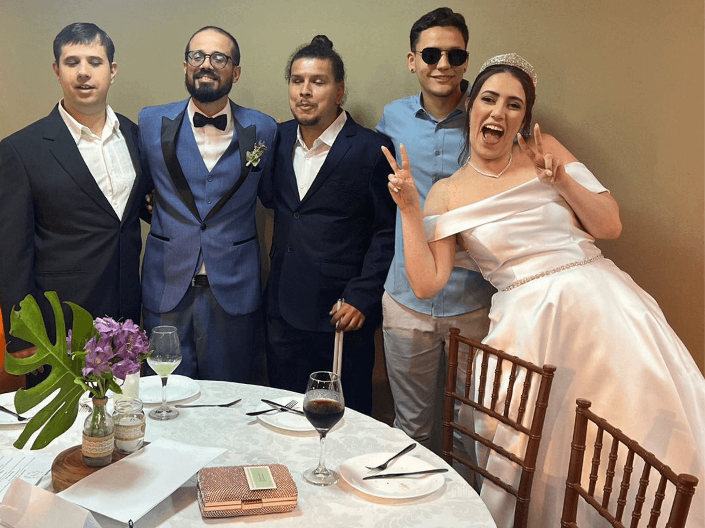

_**14 de Novembro, 2023.**_

Como tinha dito no LinkedIn iria pausar o conteúdo por um tempo, bom, estamos de volta. ❤

Eu me casei em Outubro e agora podemos retomar nosso papo semanal.

Nesse e-mail, quero contar a nossa experiência de organizar o maior projeto de nossas vidas e ainda pensar em aspectos **acessíveis para a cerimônia.**

## Um pouco da história

Eu e a Mari nos conhecemos num grupo de Facebook, e o grupo em geral conversava sobre diversos assuntos.

Até que um dia, surgiu a famosa pergunta: **"com o que você trabalha?"**, respondi que era analista de acessibilidade.

A partir de então, a Mari me chamou no privado e começou a me contar que era intérprete de LIBRAS e que seu TCC pra faculdade de publicidade era sobre acessibilidade.

Esse assunto foi o pontapé para ficarmos conversando por horas a fio, todos os dias. Eu em BH e ela em Petrópolis, pouco tempo depois disse que iria visitá-la.

Na cara e coragem fui, **6****h e 30min** de viagem. Lembro que chegando na rodoviária de lá estava muito frio. Mal sabia que ia sofrer por muitos meses esse frio 😂

Pouco tempo depois começamos a namorar e bom... Aqui estamos completando quase 1 mês de casados ❤

E hoje ambos trabalhamos com aquilo que nos uniu: **a acessibilidade**.

## O início do planejamento

Começamos a pensar no casamento e **definimos uma data**, depois começamos a refletir: _**"como vamos nos organizar para casar num prazo de um ano?"**_

Tínhamos alguns desafios pela frente:

- a distância;

- prazo do casamento;

- custo financeiro.

Como iríamos fazer a cerimônia em Petrópolis, decidimos que todos os fornecedores fossem de lá. Pesquisamos muito e conseguimos fechar com bons fornecedores. Usamos algumas ferramentas que foram cruciais para a organização.

## Obsidian

[O Obsidian](https://obsidian.md/), para quem não conhece, é um aplicativo de notas e possuí recursos fantásticos (prometo escrever sobre), ele me auxiliou bastante em cada reunião para:

- analisar valores;

- prazos;

- contratos;

- impressões pessoais.

## Google Sheets

Também usamos o Google Sheets que foi o coração da nossa organização, nele colocamos:

- parcelas de pagamentos;

- itens do casamento;

- aporte financeiro mensal.

Dessa forma, tínhamos uma visão macro do projeto.

## Todoist

Usamos o [Todoist para gerenciar as tarefas do casamento](https://todoist.com/pt-BR).

Criei um projeto chamado **Casamento** e usamos um _checklist_ de um portal de casamentos, listamos detalhadamente todas as tarefas que tínhamos à frente.

Isso que me ajudou bastante para ter uma visão prolongada do projeto e das ações que precisava realizar mês a mês.

## Cerimônia acessível

Uma das premissas que não abrimos mão foi, fazer uma **cerimônia acessível**.

Para nossa surpresa nenhum dos fornecedores tinha experiência em realizar um evento pensando em pessoas com deficiência.

Nosso desafio foi construir uma ponte de comunicação entre os fornecedores e nossa expectativa de ser acessível.

Nós trabalhamos diariamente com pessoas com deficiência e sabemos como é triste e chato elas não se sentirem incluídas.

Queríamos dar uma experiência memorável para eles.

Para fazer isso, explicamos para cada fornecedor premissas básicas de acessibilidade, como:

- a forma de conduzi-los;

- como atender as mesas.

E precisamos de contratar mais alguns serviços, como:

- cardápio em braile;

- intérprete de LIBRAS;

- audiodescrição.

O ponto mais importante foi contar com a **empatia** e **sensibilidade** de cada fornecedor.

Graças ao trabalho brilhante do nosso cerimonial, conseguimos cumprir esse desejo.

Seria hipocrisia da nossa parte não fazer isso.

Queríamos a mesma experiência para eles.

## Mas porque te contei tudo isso?

Te contei, porque a acessibilidade diz a respeito sobre pessoas e está presente no nosso dia a dia.

Nós impactamos muitas pessoas com nosso **trabalho "invisível"**.

E isso gera uma pergunta dentro de mim:

**_Porque não viabilizar experiências inclusivas no mundo real?_**

As pessoas, vivem no mundo real, o digital é somente um reflexo.

Mas como foi a experiência deles?

<table><tbody><tr><td></td></tr></tbody></table>

Foi um sucesso! Eles amaram, se emocionaram com a cerimonia e o cardápio em braile. E também aproveitaram a festa.

## Para concluir

Se cada um fizer um pouco um dia conseguimos criar uma web mais acessível.

Que você possa ser um aliado e começar a tornar acessível as experiências ao seu redor.

**_Me conta o que você achou desse e-mail, basta responder o remetente desse e-mail._**

Até semana que vem.

Soli Deo Gloria. Bruno Pulis
