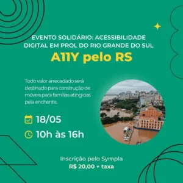

**Quarta-feira, 8 de maio de 2024.**

Essa edição é um pedido de ajuda!  
O Brasil acompanha a tragédia do Rio Grande do Sul, cidades desoladas, grandes perdas, um caos generalizado.  
Fiquei muito abalado, pois tenho amigos no sul e já passei bons momentos em Porto Alegre.

Se você quer ajudar as pessoas que perderam tudo, a oportunidade bate na sua porta.

Te apresento o [A11y pelo RS](https://www.sympla.com.br/evento-online/a11y-pelo-rs/2454833), uma iniciativa da comunidade de acessibilidade digital.

Foi idealizado pela Victoria Krupp, morada de Novo Hamburgo, uma das cidades atingidas. irá reunir grandes nomes da acessibilidade digital.

**Informações sobre o evento**

- Data: 18/05

- Horário: de 10 às 16h;

- Valor: R$ 20,00 mais a taxa do Sympla.

PS: todo valor arrecadado será convertido em fazer móveis para pessoas que perderam tudo.

PS: 2 Consultoria gratuita

Para ganhar uma consultoria gratuita comigo, basta se inscrever no evento, enviar o comprovante de inscrição para o e-mail: [hello@brunopulis.com](mailto:hello@brunopulis.com) e agendaremos um horário.
