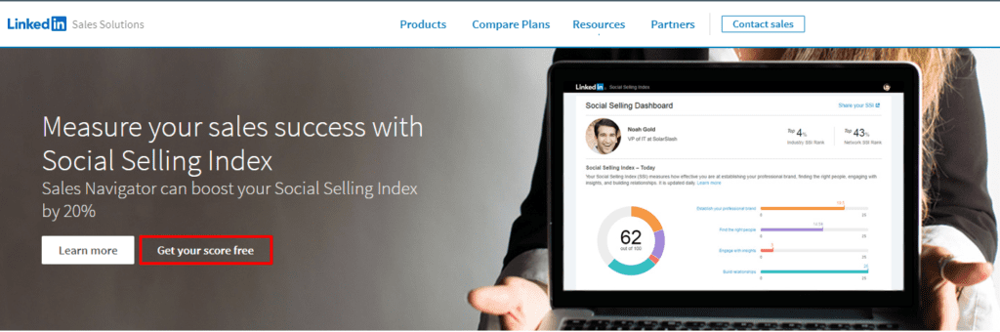
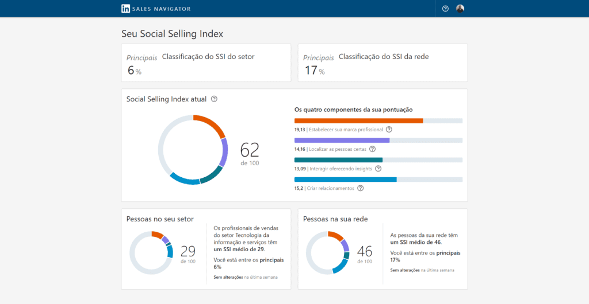
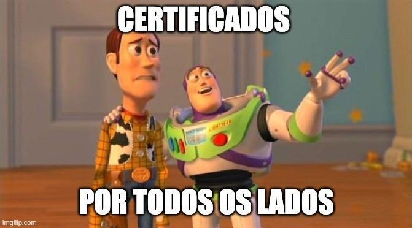

O **LinkedIn** talvez seja a maior rede social corporativa da atualidade. A plataforma cresce exponencialmente e agrega bons recursos.

Saber utilizar ela de forma estratégica pode render boas oportunidades de trabalho.

Nesse artigo, vou compartilhar 5 dicas que podem melhor seu posicionamento na rede.

Vamos lá?

---

O primeiro passo para criar um perfil campeão no LinkedIn é usar o [Social Selling Index](https://business.linkedin.com/sales-solutions/social-selling/the-social-selling-index-ssi).

## O que é o Social Selling Index?

Basicamente é uma ferramenta que auxilia o posicionamento do seu perfil na rede.

Através dela, conseguimos identificar oportunidades de melhorias, como por exemplo:

- localizar pessoas certas;
- interagir oferecendo ideias para uma boa discussão;
- criar relacionamentos.

Os componentes da sua pontuação variam de acordo com seu perfil.

Cada usuário na rede tem uma pontuação, a partir dela, seu posicionamento é definido. Para auxiliar na pontuação perfeita, o LinkedIn conta com o [Social Selling Index](https://business.linkedin.com/sales-solutions/social-selling/the-social-selling-index-ssi), que é um índice de posicionamento do seu perfil.

### Usando o Social Selling Index

Para utilizá-lo basta selecionar o botão **“Get your score free”**, conforme a imagem abaixo:

O resultado do meu _score_, no momento da escrita desse artigo, foi:

Gráficos do Social Selling Index

No meu caso , o Linkedin recomendou melhorar três aspectos:

- localizar pessoas certas;
- interagir oferecendo ideias para uma boa discussão;
- criar relacionamentos.

A partiri disso, vou modificar meu perfil com as recomendações que achei mais relevante.

## Identidade visual consistente

A máxima “uma imagem vale mais que mil palavras” nesse contexto vale muito. Ter uma identidade visual consistente é extremamente importante.

Sua identidade visual deve conter os seguintes pontos:

- **autenticidade;**
- **profissionalismo**;
- **responsabilidade**.

Opte por fotos que focam seu rosto, com um fundo colorido ou que faça contraste com sua foto. Caso você não tenha noção sobre o tema existe um serviço bem interessante o [Profile Picture Maker](https://pfpmaker.com/).

Ele gera diversos formatos para fotos de perfil, o resultado é como, por exemplo:

Percebo duas vantagens nesse serviço, Além de ser gratuito irá deixar sua foto na rede muito mais apresentável e profissional.

---

## Resumo profissional

O resumo profissional é sua porta de entrada, então **devemos caprichar** nele. Uma das dicas mais interessantes é ser sucinto e conciso, vale também escrever algumas coisas para chamar atenção dos recrutadores. O meu resumo está assim:

> Sou um **desenvolvedor** com foco em **qualidade de software e acessibilidade digital**. Adoro **trabalhar em equipe** com projetos desafiadores e criativos que mudam a vida das pessoas.
>
> Como desenvolvedor, procuro sempre as melhores práticas para um código funcional e otimizado, gosto de experimentar novas tecnologias e processos que possam melhorar o desenvolvimento.
>
> No meu tempo livre me dedico em compartilhar conhecimento com a comunidade através de palestras, podcasts, meetups, posts.

Além disso, utilizo algumas palavras-chaves como: **desenvolvedor, qualidade de software, acessibilidade digital.**

Seu resumo profissional, deve responder algumas perguntas, como:

- cargo que gostaria de ocupar? (Desenvolvedor);
- qual o seu foco/objetivo? (foco em qualidade de software);
- sua dinâmica de trabalho? (trabalho em equipe e projetos desafiadores).

## Experiências profissionais

A etapa de experiências profissionais é o fator **mais importante**, então devemos caprichar nelas. Eu uso uma fórmula que funciona muito bem.

### Fórmula para experiências profissionais

- **Breve resumo da empresa**
- **Descrição da sua função**
- **O que você se envolveu na empresa?**
- **Projeto mais importante que atuou**
- **Tecnologias utilizadas**.

Vamos analisar a minha experiência na Monetizze, por exemplo:

## Escrevendo uma experiência profissional arrasadora

Suas experiências profissionais devem conter

**Breve resumo da empresa**
A Monetizze é uma plataforma para pagamento online que oferece segurança e ferramentas de métricas e marketing para comercializar produtos na Internet.

**Descrição da função**
Como Analista de Qualidade era responsável por garantir a qualidade do produto Membertizze, onde atuei por cerca de 1 ano e meio. Contribuindo de forma significativa para a agilidade do time.

**O que você se envolveu na empresa?**

- Participação ativa nos comitês de Qualidade e Engenharia de Software, fomentando discussões e soluções para nossos problemas diários;
- Auxilei o time de DevOps na construção de pipelines para integração contínua, seguindo a pirâmide de testes;
- Escrevi testes automatizados utilizando Javascript para testar a camada de interface (UI) da aplicação com Cypress;
- Escrevi testes automatizados para validar a acessibilidade da aplicação;
- Testes com tecnologias assistivas, com o leitor de tela: NVDA;
- Suporte ao desenvolvedores no processo de Code Review e práticas relacionadas a garantia da qualidade;
- Contribuo com time também na resolução de alguns bugs codificando;
- Ministrei diversos treinamentos internos sobre qualidade de software, desenvolvimento e soft skills;
- Fomento sempre a cultura de qualidade em momentos oportunos.

## **Projeto mais importante que participou**

_Ganho de 80% na perfomance dos testes de serviços (API) na integração contínua, com essa
otimização reduzimos drasticamente o tempo de execução na pipeline._

**Ferramentas utilizadas:**

- Docker;
- Vue.js
- Cypress;
- CucumberJS;
- Gherkin;
- AccessMonitor;
- NVDA;
- AXE;
- Jest;
- PHPUnit;

Outras ferramentas:
GitlabCI, Jira, AWS, New Relic, Laravel.

As informações da sua experiência profissional devem ser relevantes, **nada de texto pra encher linguiça.**

## Competências e recomendações

Essa sessão é muito importante, pois irá mostrar ao recrutador algumas habilidades técnicas.

Minha dica, analise as competências e recomendações que façam sentido para seu perfil. Caso existam competências repetidas mantenha a que tem maior pontuação, o mesmo se aplica para as recomendações.

## Dica Bônus: Certificados e cursos

É muito comum no Linkedin, postarmos certificados e cursos, visto que, comprova novas competências e demonstrar novas competências. Porém, o Linkedin parece uma chuva de certificados, me lembrando desse meme.

A minha dica nesse sentido é: publique certificados que façam sentido e que chamem atenção, por exemplo:

- certificação oficiais como (AWS, ISTQB);
- cursos relevantes que tenham notoriedade.

Outros cursos e certificados, como participacao de um webinar, lives, meetups e eventos geralmente anexo na sessão de Certificados sem publicar na minha timeline.

Procuro deixar minha timeline bem limpa com conteúdo relevante.

Outra dica muito boa é compartilhar conteúdo, fiz uma publicação no Linkedin sobre “[Os mitos da Qualidade de Software](https://www.linkedin.com/posts/pulis_mitos-e-fatos-sobre-qualidade-e-testes-activity-6745043758552752129-kcoI)” que simplesmente viralizou, ele teve um alcance de **8.261 visualizações.**

## Conclusão

Quando obtive esses resultados, percebi como o LinkedIn é uma ferramenta poderosa. Ele já me rendeu diversas entrevistas, oportunidades e amizades.

> **E você está esperando o quê para se destacar profissionalmente**?
