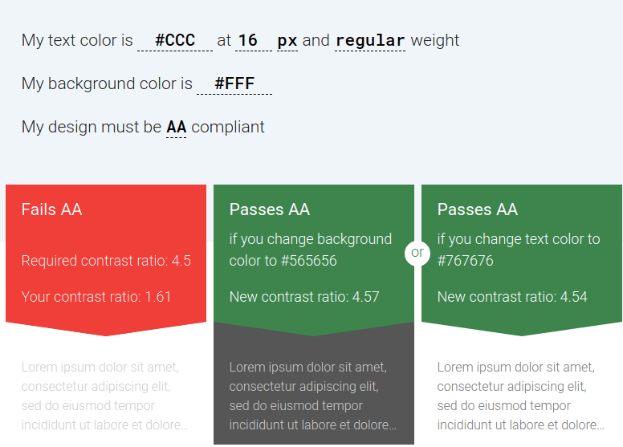

A web é um prato cheio de erros de acessibilidade, infelizmente. Hoje, vamos discutir os **6 maiores erros de acessibilidade digital,** suas implicações e barreiras de acesso e o melhor, como corrigir-los de maneira prática e objetiva. Vamos lá!

## 1\. Texto com baixo contraste


Diariamente sofro na pele com isso, para quem não me acompanha ou está chegando por agora no blog, eu possuo [ceratocone](https://drauziovarella.uol.com.br/doencas-e-sintomas/ceratocone/), uma doença na córnea que aumenta o grau exponencialmente. Algumas combinações de cores e informações ficam bastante confusas para mim.

Para amenizar esse problema adotei algumas práticas:

- dar zoom em textos com baixo contraste;
- mudo as cores dos textos para uma com maior contraste via Inspetor de elementos do navegador;
- usar tema escuro.

### Guia sobre contraste

Para aplicarmos as correções de maneira efetiva, devemos consultar as recomendações da WCAG. Abaixo as regras aplicadas ao contraste:

- [1.4.3 – Contraste (mínimo) \[AA\] — WCAG 2.0](https://www.w3.org/WAI/WCAG21/Understanding/contrast-minimum) (em inglês);
- [1.4.6 – Contraste melhorado \[AAA\] — WCAG 2.0](https://www.w3.org/WAI/WCAG21/Understanding/contrast-enhanced) (em inglês);
- [1.4.11 — Contraste Não-Textual \[AA\] — WCAG 2.1](https://www.w3.org/WAI/WCAG21/Understanding/non-text-contrast) (em inglês);
- [2.3.1 – Três flashes ou abaixo do limite \[A\] — WCAG 2.0](https://www.w3.org/WAI/WCAG21/Understanding/three-flashes-or-below-threshold).

### Ferramentas para verificação

Atualmente utilizo o [Accessible Colors](https://accessible-colors.com/), é uma boa alternativa para realizar esse tipo de teste.

A grande vantagem dele é seu feedback claro e objetivo, como, por exemplo:



Resultado de uma avaliação das cores: `#ccc` para textos do tamanho de fonte 16px e background do site `#fff`.

Após realizar o teste, podemos abrir os bugs. Uma curiosidade, a maioria desses erros conseguimos resolver com poucas linhas de CSS.

No [Awesome](https://github.com/brunopulis/awesome-a11y/blob/master/topics/tools.md#colors-and-contrast) [A11y](https://github.com/brunopulis/awesome-a11y/blob/master/topics/tools.md#colors-and-contrast) você pode encontrar diversas ferramentas para validar contraste.

## 2\. Imagens sem texto alternativo

Segundo uma pesquisa do [Web AIM](https://webaim.org/projects/million/#wcag), em uma amostragem de **1 milhão** de páginas iniciais dos sites mais populares do mundo. Foram encontradas **38.426.701** imagens, ou **38.4%** por página inicial em média.

Cerca de **31.3%** de todas as páginas iniciais (12 por página em média) **não possuíam texto alternativo** (sem contar o `alt=""`) que é uma forma válida. **Mais da metade das imagens sem texto alternativo**.

Existe uma discussão ao redor do atributo `<strong>alt</strong>`, Reinaldo Ferraz escreveu [um artigo](http://reinaldoferraz.com.br/explorando-o-atributo-alt/), onde demonstra os benefícios do atributo. Além de contribuir para a **acessibilidade,** ele também ajuda no **SEO** das páginas.

De forma prática a correção desse erro é uma das mais **banais**, basta preencher o atributo `alt` com a descrição correta da imagem.

Ex:

```html
`<span class="token tag"><span class="token tag"><span class="token punctuation"><</span>img</span> <span class="token attr-name">src<span class="token punctuation attr-equals">="</span>/imagens/duck.png<span class="token punctuation">"</span></span> <span class="token attr-name">alt<span class="token punctuation attr-equals">="</span>Pato de borracha amarelo olhando fixamente<span class="token punctuation">"</span></span> <span class="token punctuation">/></span></span>`

MarkupCopy
```

Traduzi [um guia super completo de como escrever um texto alternativo](https://brunopulis.com/texto-alternativo-o-guia-definitivo/).

## 3\. Links vazios

Esse erro é bem comum, entretanto não deveria ser tão encontrado nas páginas web.

Frequentemente encontramos em **ícones** ou botões de ação sem nenhuma ação, não é mesmo? Para entendermos isso, consultaremos a definição do propósito do elemento `<strong><a></strong>`:

> O elemento `<strong><em><a></em></strong>` em HTML (ou elemento âncora), com o atributo _**`href`**_ cria-se um hiperligação nas páginas web, arquivos, endereços de e-mails, ligações na mesma página ou endereços na URL. O conteúdo dentro de cada `<a>` **precisa indicar o destino do link**.

Usar sem definir o conteúdo textual descumpre a especificação do HTML e a recomendação [2.4.4 – Finalidade do link (em contexto) \[A\] — WCAG 2.0 (em inglês)](https://www.w3.org/TR/WCAG21/#link-purpose-in-context).

### Exemplo prático

Temos um link que inclui um ícone de rede social, mas não possuí um texto para descrever a ação. Dessa forma, os leitores de tela irão ler: **“Link”**.

```html
<a href="https://twitter.com/obrunopulis">
  <i class="fa fa-twitter"></i>
</a>
```

Qualquer validador de acessibilidade encontrará esse problema, pois o elemento `<strong><em><a></em></strong>` encontra-se sem nenhum conteúdo textual, descumprindo seu propósito.

Dessa forma, os leitores de tela não conseguem identificar o link em questão.

Uma possível solução, seria adicionar o texto visualmente ao lado dos ícones, pois eles nem sempre são tão claros para os usuários quanto pensamos.

No caso dos ícones sociais, acho que é bastante claro o que são e o padrão é usado com bastante frequência. Nesse caso, você pode adicionar conteúdo visualmente oculto.

### Corrigindo

Queremos adicionar texto para ser lido por um leitor de tela e ter certeza de que o conteúdo adicionado via CSS não seja lido.

```html
`<span class="token tag"><span class="token tag"><span class="token punctuation"><</span>a</span> <span class="token attr-name">href<span class="token punctuation attr-equals">="</span>https://twitter.com/obrunopulis<span class="token punctuation">"</span>></span></span>   <span class="token tag"><span class="token tag"><span class="token punctuation"><</span>span</span> <span class="token attr-name">class<span class="token punctuation attr-equals">="</span>fa fa-twitter<span class="token punctuation">"</span></span> <span class="token attr-name">aria-hidden<span class="token punctuation attr-equals">="</span>true<span class="token punctuation">"</span>><span class="token punctuation"></</span>span></span></span>     <span class="token tag"><span class="token tag"><span class="token punctuation"><</span>span</span> <span class="token attr-name">class<span class="token punctuation attr-equals">="</span>sr-only<span class="token punctuation">"</span>></span></span>Perfil de Bruno Pulis no twitter<span class="token tag"><span class="token tag"><span class="token punctuation"></</span>span><span class="token punctuation"></</span>a></span></span>`

MarkupCopy
```

Com essa abordagem os validadores de acessibilidade não encontrarão nenhum problema, pois o link contém um texto oculto que informa o seu destino.

### Observação importante

Nem sempre ter um conteúdo oculto é uma boa solução. É preciso haver uma compreensão visual de qual é o conteúdo e os links para usuários videntes, bem como para usuários de leitores de tela.

## 4\. Labels de formulários ausentes

Dos 4,2 milhões de formulário identificados na pesquisa do WebAIM, 55% não estavam usando o elemento `<strong><label></strong>`, `<strong><em>aria-label</em></strong>` ou `<strong><em>aria-labelledby</em></strong>`.

Páginas com pelo menos um controle de formulário sem rótulo tiveram **em média mais 43 erros detectáveis** do que páginas sem nenhum erro de rótulo.

Com efeito, é preocupante o descuido pela escrita do HTML, a grande maioria dos problemas são originados de uma escrita descuidada.

A saber, formulários são um dos componentes mais importantes para web, podemos dizer que depois do elemento `<a>` esse componente é o mais importante.

Com essas violações também ferem a recomendação [3.3.2 – Rótulos e instruções \[A\] – WCAG 2.0 – (em inglês)](https://www.w3.org/WAI/WCAG21/Understanding/labels-or-instructions).

Uma das coisas que percebo muito com formulários é o uso inadequado do placeholder, a maioria dos designers e desenvolvedores utilizam o atributo `placeholder` com a função de um `<label>`.

### Exemplo incorreto

```html
<form>
   <input type="email" placeholder="insira o seu melhor e-mail" />
</form>
```

O atributo `placeholder` é uma string que fornece uma breve dica ao usuário quanto ao tipo de informação esperado no campo. Deve ser uma palavra ou frase curta que demonstre o tipo de dados esperado, ao invés de uma mensagem explicativa.

**_Nota: O atributo placeholder não é semanticamente útil como outras maneiras de explicar seu formulário e pode causar problemas técnicos inesperados com seu conteúdo._**

> Vale lembrar, para rotular um formulário o elemento correto para ser usado é o `label`

### Exemplo correto

```html
<form>
  <label for="email">E-mail</label>
  <input type="email" id="email" placeholder="insira o seu melhor e-mail" />
</form>
```

## 5\. Botões vazios

Semelhantemente com os links vazios, os botões vazios querem dizer que o elemento não possuí uma informação textual definida. Quando navegamos no botão, um texto descritivo deve ser apresentado ao leitor de tela para indicar qual tipo de função que o botão possuí.

Além disso, essa violação fere duas recomendações da WCAG:

- [1.3.3 – Características sensoriais \[A\] — WCAG 2.0 (em inglês)](https://www.w3.org/WAI/WCAG21/Understanding/sensory-characteristics);
- [2.5.3 – Rótulo no nome acessível \[A\] — WCAG 2.1 (em inglês)](https://www.w3.org/WAI/WCAG21/Understanding/label-in-name)

O exemplo a seguir, demonstra o problema de um botão sem informação textual.

```html
<button type="submit">
  <svg id="search" viewBox="0 0 16 16.9">
     <path d="..."></path>
  </svg>
</button>
```

Qualquer validador de acessibilidade notificará a inconsistência da violação das guidelines citadas acima. Para eles não existe um conteúdo textual definido, uma abordagem para correção seria inserir o elemento `<title>` no SVG, pois ele garante que SVGs sejam acessíveis. Scott O’Hara escreveu um artigo [imagens acessíveis e SVGS (em inglês)](https://www.scottohara.me/blog/2019/05/22/contextual-images-svgs-and-a11y.html).

```html
<button type="submit">
  <svg id="search" role="img" aria-describedby="searchIcon" viewBox="0 0 16 16.9" >
     <title id="searchIcon">Search</title>
     <path d="..."></path>
  </svg>
</button>
```

## 6\. HTML sem idioma definido

A linguagem no documento HTML na maioria das vezes é ignorada ou esquecida. Já fiz diversas avaliações em sites com conteúdos totalmente em português e a definição do idioma em inglês.

Usuários de leitores de tela, utilizam o sintetizador de voz embutido nos softwares para ler o conteúdo. Dessa forma, uma das primeiras coisas que o sintetizador de voz faz é identificar o idioma atribuído a página.

Além disso, é configurado a **entonação**, **ritmo** e **sotaque** da língua definida no documento. Em contrapartida, se não encontrar um idioma, ele define o inglês como padrão.

Além dessa confusão, ele descumpre a recomendação [3.1.1 – Idioma da página \[A\] — WCAG 2.0 (em inglês)](https://www.w3.org/WAI/WCAG21/Understanding/language-of-page)

### Corrigindo

```html
<!DOCTYPE html>
<html lang="pt-br"> ... </html>
```

Você também pode, [explorar mais sobre o atributo lang](https://brunopulis.com/usando-o-atributo-lang-corretamente/) em outro artigo que escrevi.

## Conclusão

Percorremos todos os bugs, entretanto fica nítido que precisamos de conscientização para resolver esses problemas.

Além disso, os desenvolvedores devem aprender de maneira correta os padrões web e HTML semântico. Dessa forma, grande parte desses problemas vão desaparecer.

Em conclusão, reciclar nosso conhecimento é primordial.

E para reflexão gostaria de deixar uma frase do Tim Berners-Lee:

> O poder da Web está na sua universalidade. O acesso por todas as pessoas, não obstante a sua **incapacidade**, é um aspecto essencial.

## Referências

- [Guia WCAG](https://guia-wcag.com/)
- [Pesquisa do WebAIM](https://webaim.org/projects/million/#errors)
- [Accessible Colors](https://accessible-colors.com/)
- [Empty link example](https://blog.pope.tech/2020/03/13/empty-link-example/)
- [Documentação do elemento A](https://developer.mozilla.org/pt-BR/docs/Web/HTML/Element/a)
- [Documentação do atributo placeholder](https://developer.mozilla.org/en-US/docs/Web/HTML/Element/input#attr-placeholder)
- [Explorando o atributo alt](http://reinaldoferraz.com.br/explorando-o-atributo-alt/).
