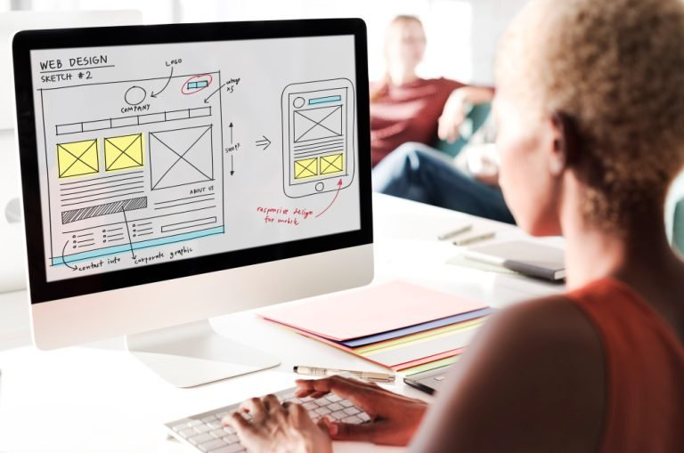
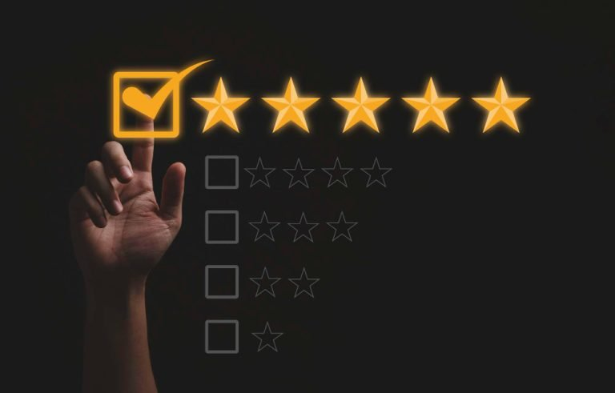
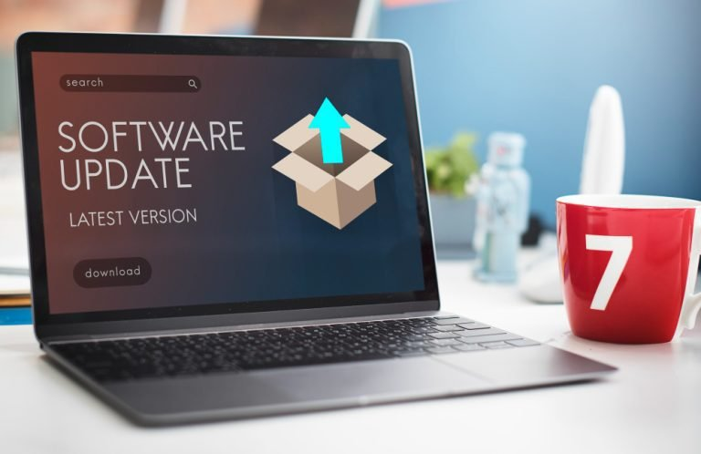

Construir um software envolve diversas áreas: comunicação, marketing, equipe de negócios, design, experiência do usuário, equipe técnica e tantos outros envolvidos.

Mas afinal, o que seria construir um software com qualidade?

Essa pergunta pode ter diversas respostas, entretanto, a [**ISO/IEC 25010**](https://iso25000.com/index.php/en/iso-25000-standards/iso-25010) foi criada para ser um alicerce quando falamos em construção de software.

Com ela, podemos avaliar a qualidade de um sistema a partir de princípios que foram desenhados. Cada princípio analisa o software de um ponto de vista.

Nesse artigo, iremos navegar por cada princípio e suas subcaractéristicas e como eles podem nos auxiliar.

Vamos lá?

## Adequação funcional

[Image by gpointstudio](https://www.freepik.com/free-photo/business-requires-lot-creativity_13191173.htm#query=requirements&from_query=requisitos&position=0&from_view=search&track=sph) on Freepik

Todo sistema deve permitir os usuários realizarem tarefas específicas. Essa habilidade é chamada de **adequação funcional**.

Para isso acontecer devemos criar funcionalidades, que esperam alguma ação do usuário para respondê-lo, de acordo com seu pedido.

## Eficiência de desempenho

[Image by rawpixel.com](https://www.freepik.com/free-photo/digital-increasing-bar-graph-with-businessman-hand-overlay_13312397.htm#query=perfomance&position=19&from_view=search&track=sph) on Freepik

Acredito que todo mundo detesta um software lento. Particularmente eu odeio, fico impaciente e dependendo da situação acabo desinstalando ou deixo de lado.

Esse princípio reflete justamente esse aspecto. O software deve ser capaz de responder em tempo hábil, sem deixar o usuário esperando.

Outros pontos importantes, como por exemplo: a **utilização de recursos** e sua **capacidade**.

## Compatibilidade

[Image by macrovector](https://www.freepik.com/free-vector/smartphone-compatible-smartwatch-data-transfer-symbols_4266186.htm#page=2&query=compatibility&position=48&from_view=keyword) on Freepik

Na minha opinião todo software deveria ser compatível, mas sei que isso não é uma realidade. Principalmente em consoles de video-games, onde existe uma briga de mercado gigante nesse aspecto.

Uma das empresas que mais me irritava nesse sentido era a Microsoft. Bastava lançar uma nova versão do Excel, por exemplo, e a versão antiga já não era compatível com a nova.

Penso que, era uma estratégia de venda para atualizar os softwares, entretanto, nem sempre era viável realizá-la.

A interoperabilidade é a capacidade de executar o software independente da estrutura. Essa caractéristica é muito importante, pois, permite alçancar um número maior de pessoas.

## Usabilidade

[Imagem de rawpixel.com](https://br.freepik.com/fotos-gratis/conceito-de-conteudo-de-tecnologia-online-de-design-da-web_17095743.htm#query=usability&position=10&from_view=search&track=sph) no Freepik

Usabilidade é a habilidade dos usuários aprenderem de forma simples com o minimo esforço.

Alguns itens necessitam de serem cumpridos para terem uma boa usabilidade.

Como por exemplo:

-   Reconhecimento de adequação;
-   Aprendizagem;
-   Operabilidade;
-   Proteção contra erros do usuário;
-   Estética da interface do usuário;
-   Acessibilidade.

Todas essas subcaracterísticas são importantes, entretanto, quero destacar a acessibilidade.

A acessibilidade é extremamente relevante para a usabilidade. Não temos um software usável sem acessibilidade, ou vice-versa.

Contudo, vale sempre lembrar:

> Entregar um software com boa usabilidade e não pensar em acessibilidade é um grande erro.

## Confiabilidade

[Image by DilokaStudio](https://www.freepik.com/free-photo/hand-touching-doing-mark-five-yellow-stars-black-background-best-customer-satisfaction-evaluation-good-quality-product-service_24458776.htm#query=reliable&position=39&from_view=keyword) on Freepik

Confiabilidade diz a respeito do sucesso de seu software. Ninguém gosta de utilizar algo que não seja confiável.

Ainda mais, com os escandâlos de vazamento de dados recentes, se previnir e usar ferramentas adequadas é essencial.

Comecei a abandonar algumas redes sociais e outros serviços por causa desse princípio.

Quando falamos de confiabilidade, alguns itens são importantes de citar, como por exemplo:

-   **Maturidade**: mede a frequencia de defeitos apresentados;
-   **Disponibilidade**: mede o quanto o software encontra-se disponível para os usuários;
-   **Tolerância a falhas**: como o software reage em situação de falhas;
-   **Recuperabilidade**: capacidade de recuperar de um incidenten.

## Segurança

[Imagem de rawpixel.com](https://br.freepik.com/fotos-gratis/mao-segurando-sistema-de-nuvem-com-protecao-de-dados_17121563.htm#query=cyber%20security&position=8&from_view=search&track=sph) no Freepik

Além da confiabilidade a segurança, no meu ponto de vista, é um dos pontos mais importantes. Afinal, ninguém quer utilizar algo inseguro, não é mesmo?

Sempre quando falamos de segurança, esse conceito vem acompanhado de outros poucos conhecidos, como:

-   **Confidencialidade**: somente sistemas/pessoas autorizadas acessam um recurso;
-   **Integridade**: não permite sistemas/pessoas não autorizadas acessam um recurso;
-   **Rastreabilidade de uso**: rastreia ações do usuário, a fim de, comprovar suas ações;
-   **Autenticidade**: identifica se você é quem alega ser.

## Capacidade de Manutenção

[Imagem de rawpixel.com](https://br.freepik.com/fotos-gratis/atualizacao-atualizacao-nova-versao-melhor-conceito-grafico_18042703.htm#query=update%20software&position=1&from_view=search&track=sph) no Freepik

Para qualquer sistema a manutenção é muito importante. Quem nunca sofreu com as atualizações do Windows, que atire a primeira pedra. 😂

Mesmo que isso seja incomôdo, é necessário para prevenir ataques maliciosos e permitir que o sistema mantenha-se “sadio”.

Quando a manutenção é realizada, podemos avaliar os seguintes pontos:

-   Modularidade;
-   Reutilização;
-   Analisabilidade;
-   Modificabilidade;
-   Testabilidade.

## Portabilidade

[Image by pch.vector](https://www.freepik.com/free-vector/happy-tiny-man-woman-with-big-open-wallet_8609334.htm#page=4&query=portabilidade&position=38&from_view=search&track=sph) on Freepik

Sempre quando ouço a palavra portabilidade, penso logo, em operadoras de telefonia.

Antigamente, quando precisavamos trocar de uma operadora para outra, era bem complicado. Não tinhamos a capacidade de se adaptar ao novo contexto.

Muitas vezes, essa migração era instável e a capacidade de substituição era praticamente impossível.

Mas tudo teve um final feliz, com o avanço da tecnologia hoje é possível realizar isso de forma quase instantânea.

Com a portabilidade, hoje temos a autonomia de poder decidir quando trocar para um serviço que nos atenda melhor.

-   Adaptabilidade;
-   Instalabilidade;
-   Capacidade de substituição.

Esses são os princípios que norteiam o trabalho e tipos de testes de um QA. Além disso, [existem 21 qualidades que todo QA deve ter](https://brunopulis.com/21-qualidade-de-um-bom-qa/).

## Bônus: indicação de livros

Para concluir gostaria de deixar algumas indicações de leitura. As três indicações são valiosas bases para o conhecimento em testes de software. Entretanto, não são as únicas gosto bastante delas.

-   [Base de conhecimento em teste de software;](https://www.amazon.com.br/Base-Conhecimento-em-Teste-Software/dp/8580630533?crid=1DQEN7AGYXIUX&keywords=base+de+conhecimento+em+teste+de+software&qid=1686710879&sprefix=Base+de+conhecimen%2Caps%2C221&sr=8-1&linkCode=li3&tag=pulis-20&linkId=03f874dd80a176cc1a52f81e267bbd3f&language=pt_BR&ref_=as_li_ss_il)
-   [Introdução ao teste de software](https://www.amazon.com.br/Introdu%C3%A7%C3%A3o-Teste-Software-Marcio-Delamaro-ebook/dp/B01JMAC4HU?__mk_pt_BR=%C3%85M%C3%85%C5%BD%C3%95%C3%91&crid=2EBNKJLV1H0DW&keywords=introdu%C3%A7%C3%A3o+ao+teste+de+software&qid=1686712129&sprefix=introducao+ao+teste+de+software%2Caps%2C238&sr=8-1&linkCode=li3&tag=pulis-20&linkId=1b102d60ef0b5e7bb940f613399cda84&language=pt_BR&ref_=as_li_ss_il);
-   [Lessons Learned Software Testing Context Driven](https://www.amazon.com.br/Lessons-Learned-Software-Testing-Context-Driven/dp/0471081124?crid=2TFWNYA94YUBU&keywords=lessons+learned+in+software+testing&qid=1686712164&sprefix=Lessons+lear%2Caps%2C208&sr=8-1&ufe=app_do%3Aamzn1.fos.6a09f7ec-d911-4889-ad70-de8dd83c8a74&linkCode=li2&tag=pulis-20&linkId=82c68364eca87bac669cc3262dfa5db7&language=pt_BR&ref_=as_li_ss_il).

## Conclusão

Concluíndo, os princípios de qualidade de software levaram você ter uma visão muito mais ampla sobre qualidade.

E conseguirá de fato medir a qualidade baseada em itens sólidos.