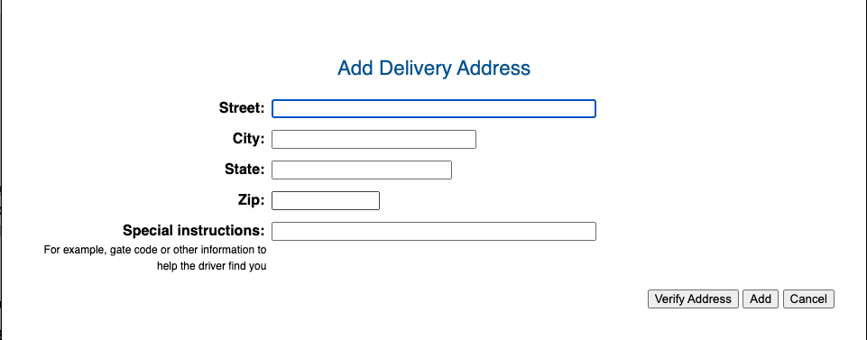

Como QA, somos responsáveis por garantir a qualidade do software.

Uma das etapas mais importantes é a análise dos **critérios de aceite.**

Essa etapa consiste em analisar, validar e verificar os artefatos de cada estória.

Um dos aliados aos critérios de aceite é a acessibilidade. Neste artigo, vamos explorar a sua relação.

## Recapitulando, o que é acessibilidade na web?

Antes de mais nada, devemos recapitular o que é acessibilidade na web.

Acessibilidade na web é a capacidade de pessoas com deficiência poderem consumir produtos e serviços na internet de forma autônoma, promovendo assim, liberdade de escolha e qualidade de vida.

Foi dada a largada de mais uma, sprint, como um bom analista de qualidade você inicia os preparativos para manter seu trabalho de forma organizada, clara e documentada.

Assim, fazemos uma análise dos requisitos de cadas estória que será trabalhada durante a sprint. Percebemos que o produto não está conformidade as diretrizes de acessibilidade e, por consequência, quebra um dos pilares da qualidade descritos na **ISO 25010**.

O que fazer nessa situação?

## Conceito de Critério de Aceite

Os critérios de aceitação são as condições que um produto de software deve atender para ser aceito por um usuário, cliente ou outro sistema. Eles são exclusivos para cada história de usuário e **definem o comportamento** do recurso da perspectiva do usuário final**. Critérios de aceitação bem escritos ajudam a evitar resultados inesperados** no final de um estágio de desenvolvimento e garantem que todas as partes interessadas e usuários fiquem satisfeitos com o que obtêm[\[1\]](https://www.altexsoft.com/blog/business/acceptance-criteria-purposes-formats-and-best-practices).

Podemos utilizar os critérios de aceite das mais variadas formas, como, por exemplo:

- Orientado a cenários (Gherkin);
- Checklist;
- Formatos personalizados.

## Garantindo a acessibilidade nos critérios

Num ambiente ágil, ocorre a famosa reunião dos **_Three Amigos_**, onde _PO_, _QA_ e líder técnico fazem o refinamento de funcionalidades candidatas para uma sprint.

O objetivo dessa reunião e ter uma visão do mesmo problema em aspectos diferentes. O negócio exige determinados aspectos, enquanto o líder técnico apresenta as possibilidades de desenvolvimento. Em contrapartida, nós analistas de qualidade visamos criticar o produto e levantar cenários de testes funcionais e não funcionais.

Neste momento, podemos elencar critérios de acessibilidade. Para exercitarmos, iremos pensar num componente de interface bem comum no cotidiano: uma janela modal.

## Escrevendo a estória de usuário

Como descrição da atividade, o PO levou para o refinamento os seguintes critérios:

Na aplicação da ACME Corportarion, no fluxo de Compras devemos exibir um botão onde o usuário poderá incluir seu endereço de entrega. Ao clicar nesse botão deve ser exibido uma modal para o preenchimento do seu endereço.

A estória de usuário foi definida, de acordo, com a especificação abaixo:

```gherkin
Como usuário gostaria quando selecionar "Add Delivery Address" seja exibido um formulário para preencher meu endereço.
```

Em um _brainstorming_, foi levantado o protótipo que tem o objetivo de concluir a jornada de cadastro de endereço.



Exemplo de modal

Pensando de forma analítica, costumo prestar atenção nos detalhes especificamente quando temos palavras mágicas como: **alta retenção, jornada de compras**. Sabendo da importância disso, comecei imaginar alguns critérios.

## Definindo os critérios

Aparentemente é uma tela inocente de fácil implementação, porém, como diz o ditado “o diabo mora nos detalhes”. Ela servirá de um bom exercício para identificarmos critérios de aceite voltados para a acessibilidade especificamente.

## Comportamentos

Devemos prever os comportamentos desse componente, por exemplo:

- quais são as teclas que exibem e ocultam a modal?
- quais teclas de atalho deverão ser mapeadas?
- como será a apresentação desse componente na tela?
- existirá algum elemento que receberá o foco quando ela for exibida?

Com esses questionamentos, poderíamos refinar os critérios conforme abaixo.

```gherkin
[ACME-123] Cadastro de Endereço de Entrega

Como usuário gostaria quando selecionar "Add Delivery Address" seja exibido um formulário para preencher meu endereço.

Critérios de Aceite

A modal deve ocupar 100% da tela, permitindo o conteúdo ser mais fácil de ler e ser exibido em telas pequenas;
Deve ser seguido o mapeamento das teclas de acordo com a tabela Suporte ao teclado
Deve ser exibida a modal através do clique no botão "Add Delivery Address";
Deve ser exibida a modal através do teclado no botão "Add Delivery Address":
deve ser aberta com a tecla ENTER;
deve ser aberta com a tecla SPACE.
A navegação deve ser somente na modal;
Não deve focar outros elementos que não estão no contexto da modal;
O foco inicial deve ser no primeiro input do formulário;
A janela modal não precisa de uma descrição extra (aria-describedy);
O botão de "Cancel" fecha a modal e retornar o foco para o botão "Add Delivery Address";
A tecla ESC deve fechar a modal e retornar o foco para o botão "Add Delivery Address";
```

## Suporte do teclado

<table><thead><tr><th>Tecla</th><th>Funcionalidade</th></tr></thead><tbody><tr><td>Tab</td><td>Move o foco para o próximo elemento focalizável dentro da modal.</td></tr><tr><td>Quando o foco está no último elemento focalizável da modal, move o foco para o primeiro elemento focalizável da modal.</td></tr><tr><td>Shift + Tab</td><td>Move o foco para o elemento focalizável anterior dentro da modal.</td></tr><tr><td>Quando o foco está no primeiro elemento focalizável da modal, move o foco para o último elemento focalizável na modal.</td></tr><tr><td>ESC</td><td>Fecha a modal.</td></tr></tbody></table>

## Conclusão

Dessa forma, conseguimos prevenir possíveis inconsistências relacionadas a acessibilidade, garantindo assim, o cumprimento das diretrizes de acessibilidade.

Note que fizemos um bom apanhando de critérios e fomos, de certa forma, bem minuciosos. A dica é começar a exercitar isso aos poucos.

E você já conseguiu contribuir com algum critério de aceite, pensando em acessibilidade?

## Referências

- Altexsoft.com, 2021. Disponível em: [https://www.altexsoft.com/blog/business/acceptance-criteria-purposes-formats-and-best-practices](https://www.altexsoft.com/blog/business/acceptance-criteria-purposes-formats-and-best-practices). Acesso em: 22 de Abril de 2021.
- W3C, 2021. Disponível em: [https://www.w3.org/WAI/ARIA/apg/patterns/dialogmodal/](https://www.w3.org/WAI/ARIA/apg/patterns/dialogmodal/). Acesso em: 23 de Abril de 2021.
