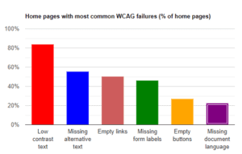

Gráficos, mapas e infográficos estão presentes em nossas vidas, mas é quando essas informações não estão acessíveis?

Pessoas com deficiência, não conseguem compreender eles devido a falta de acessibilidade.  
Nesse artigo, vou te mostrar duas técnicas que podem melhorar isso.

Vamos lá?

## O que são imagens complexas?

São representações visuais que contêm informações que não podem ser transmitidas através de uma sentença ou frase curta, como por exemplo:

-   fluxogramas;
-   organogramas;
-   diagramas e ilustrações em que o texto da página depende da capacidade do usuário de compreender a imagem;
-   infográficos;
-   mapas mostrando locais ou outras informações como sistemas climáticos;
-   os famosos CAPTCHAs.

Nesses cenário o atributo **ALT** não funciona bem, Dessa forma precisamos encontrar outras soluções.  
Escrevi um guia completo sobre [como escrever textos alternativos](https://brunopulis.com/texto-alternativo-o-guia-definitivo/).

## Criando gráficos acessíveis

Como exemplo, vou usar o gráfico da pesquisa [WebAim Million.](https://webaim.org/projects/million/) Seu objetivo é mostrar os erros de acessibilidade das páginas na web.



Para criar gráficos acessíveis, podemos usar duas técnicas: tabelas semânticas e atributos ARIA.

### Solução 1: usando tabelas

Essa solução é simples, basicamente vamos representar o gráfico em uma tabela HTML. Vale lembrar que marcar a tabela de forma semântica é importante.

Devemos colocar a tabela logo abaixo do gráfico, leitores de tela leem o HTML por ordem de declaração no DOM.

Dessa forma, usuários de leitores de tela terão várias formas de acesso, possibilitando assim, a navegabilidade nas informações.

Vamos usar duas abordagens com tabelas, a primeira será manter ela visível para todos, e a segunda exibiremos somente para os leitores de tela.

#### Exibindo a tabela

Para fins didáticos vou considerar somente o erro de baixo contraste e texto alternativo no exemplo. A estrutura HTML da nossa tabela será da seguinte forma:

```
<table>
    <caption>Home pages with most common WCAG 2 failures</caption>
    <tbody>
       <tr>
         <th scope="col">WCAG Failure Type</th>
         <th scope="col">% of home pages in 2022</th>
         <th scope="col">% of home pages in 2021</th>
         <th scope="col">% of home pages in 2020</th>
         <th scope="col">% of home pages in 2019</th>
       </tr>
       <tr>
         <th scope="row">Low contrast text</td>
         <td>83.9%</td>
         <td>86.4%</td>
         <td>86.3%</td>
         <td>85.3%</td>
       </tr>
       <tr>
         <th scope="row">Missing alternative text for images</td>
         <td>55.4%</td>
         <td>60.6%</td>
         <td>66%</td>
         <td>68%</td>
       </tr>
    </tbody>
</table>
```

Detalhe importante estou usando o atributo `<strong><em>scope</em></strong>`, ele define o cabeçalho de uma coluna ou linha. Iremos usar os seguintes valores:

-   **row:** o cabeçalho refere-se a todas as células da linha a que pertence;
-   **col:** o cabeçalho refere-se a todas as células da coluna a que pertence.

Quando navegamos com o leitor de telas ele identifica esses atributos e conseguimos ter uma navegação mais linear e fluída dentro da tabela.

#### Ocultando tabela visualmente

A única diferença da tabela anterior é uso de uma classe CSS para ocultar a tabela visualmente, dessa forma somente o leitor de tela irá consumir a informação.

```
<table class="visually-hidden">
    <caption>Home pages with most common WCAG 2 failures</caption>
    <tbody>
       <tr>
         <th scope="col">WCAG Failure Type</th>
         <th scope="col">% of home pages in 2022</th>
         <th scope="col">% of home pages in 2021</th>
         <th scope="col">% of home pages in 2020</th>
         <th scope="col">% of home pages in 2019</th>
       </tr>
       <tr>
         <th scope="row">Low contrast text</td>
         <td>83.9%</td>
         <td>86.4%</td>
         <td>86.3%</td>
         <td>85.3%</td>
       </tr>
       <tr>
         <th scope="row">Missing alternative text for images</td>
         <td>55.4%</td>
         <td>60.6%</td>
         <td>66%</td>
         <td>68%</td>
       </tr>
    </tbody>
</table>
```

### Solução 2: usando atributos ARIA

Outra técnica interessante é utilizar o atributo **_aria-describedby_**, ele é utilizado para estabelecer um relacionamento entre _widgets_ ou grupos e o texto que o descreve.

Também pode ser usado uma sequência de ids ou somente um. Ele não está limitado a controles de formulários. Pode ser usado em contextos globais dentro de um documento HTML.

```


<div id="description"> 
  <h2>Taxa de falhas de baixo contraste em porcentagem por ano</h2> 
  <ul>
     <li>Em 2019: 85.3%</li> 
     <li>Em 2020: 86.3%</li> 
     <li>Em 2021: 86.4%</li>
     <li>Em 2022: 83.9%</li>
  </ul>
</div>
```

Com o `aria-describedby` aplicado, o leitor de telas irá ler o atributo `alt` e logo após será direcionado ao conteúdo da `<div>` que contém o ID com valor de _description_.

Dessa forma as duas informações se complementam e conseguimos passar uma informação com maior relevância para todos os usuários.

## Conclusão

Percebemos que as adequações de acessibilidade para tornar a experiência mais acessível são simples. Entretanto, vale salientar que essas são algumas de várias soluções que podemos utilizar.

Tanto as tabelas como os atributos ARIA tem suas vantagens, devemos olhar o nosso contexto e tentar adequar a nossa realidade.

Me conte nos comentários as dificuldades que já teve nesse tema.

## Referências

-   [https://accessibility.psu.edu/images/charts/](https://accessibility.psu.edu/images/charts/)
-   [https://www.w3.org/TR/WCAG21/#text-alternatives](https://www.w3.org/TR/WCAG21/#text-alternatives
    )
-   [https://www.w3.org/WAI/WCAG21/Understanding/non-text-content.html](https://www.w3.org/WAI/WCAG21/Understanding/non-text-content.html
    )
-   [https://www.w3.org/WAI/WCAG21/quickref/?showtechniques=111#non-text-content](https://www.w3.org/WAI/WCAG21/quickref/?showtechniques=111#non-text-content
    )
-   [https://www.w3.org/WAI/WCAG21/Understanding/use-of-color.html](https://www.w3.org/WAI/WCAG21/Understanding/use-of-color.html
    )
-   [https://www.w3.org/WAI/WCAG21/Techniques/general/G95.html#examples](https://www.w3.org/WAI/WCAG21/Techniques/general/G95.html#examples
    )
-   [https://www.w3.org/WAI/WCAG21/Techniques/general/G73](https://www.w3.org/WAI/WCAG21/Techniques/general/G73
    )
-   [https://webaim.org/projects/million/](https://webaim.org/projects/million/
    )
-   [https://developer.mozilla.org/en-US/docs/Web/Accessibility/ARIA/Attributes/aria-describedby](https://developer.mozilla.org/en-US/docs/Web/Accessibility/ARIA/Attributes/aria-describedby
    )
-   [https://developer.mozilla.org/en-US/docs/Web/HTML/Element/th](https://developer.mozilla.org/en-US/docs/Web/HTML/Element/th)