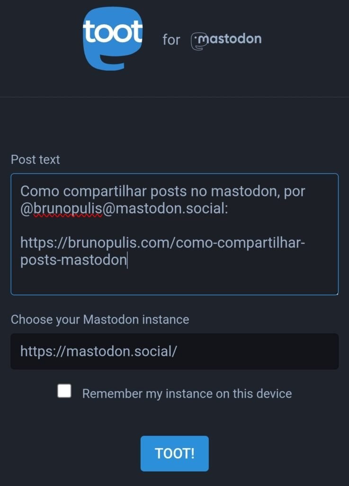

## Introdução

Hoje aprendi uma forma de compartilhar as postagens do seu blog WordPress no Fediverso através do Mastodon.

Vou te ensinar como fazer isso passo a passo, vamos lá?

Vi essa técnica no blog do [Jens Oliver Meie](https://meiert.com/en/biography/), no artigo [Website Optimization Measures, Part XXVI · Jens Oliver Meiert](https://meiert.com/en/blog/optimization-measures-26/).

Achei curioso porque me parecia bem simples, de fato, minhas suspeitas foram confirmadas.  
No blog do Jens, existe um a sessão que incentiva o usuário a compartilhar o post no Mastodon.

Isso é conhecido como _“toot”_, uma espécie de _tweet_ do Mastodon. O resultado final será semelhante a isso.



Para chegar nesse formato, vamos precisar de algumas informações importantes:

- Título do artigo;
- Seu usuário do Mastodon;
- Link do artigo.

A instância do Mastodon, podemos predefinir ou deixar o usuário decidir. Recomendo deixar livre para o usuário, pois, o Mastodon é uma rede social descentralizada bem diferente do X ou Instagram.

## Informações do WordPress e estrutura

Para compartilhar o post do WordPress no Mastodon, iremos precisar de duas funções:

- `the_title()` para pegar o título do post;
- `the_permalink()` para buscar a url da publicação no seu blog.

Nossa estrutura deve seguir o seguinte padrão:

> Título do artigo, por seu usuário do Mastodon: espaço de uma linha e o link do artigo.

## Montando o link de compartilhamento

A estrutura da URL de compartilhamento do Mastodon ficaria da seguinte forma:

```php
<a href="https://toot.kytta.dev/?text=<?php the_title(); ?>%20por%20@brunopulis@mastodon.social%3A%0A%0A<?php the_permalink() ?>">Toot</a>
```

Você deve ter percebido, que existem uns caracteres estranhos, eles tem funções específicas:

- %20: cria um espaço entre as palavras;
- %3A gera o caracter “:”;
- %0A%0A: cria os espaços entre as linhas.

## Conclusão

Pronto, seu post pode ser compartilhado no Mastodon.  
Gostou dessa dica?
