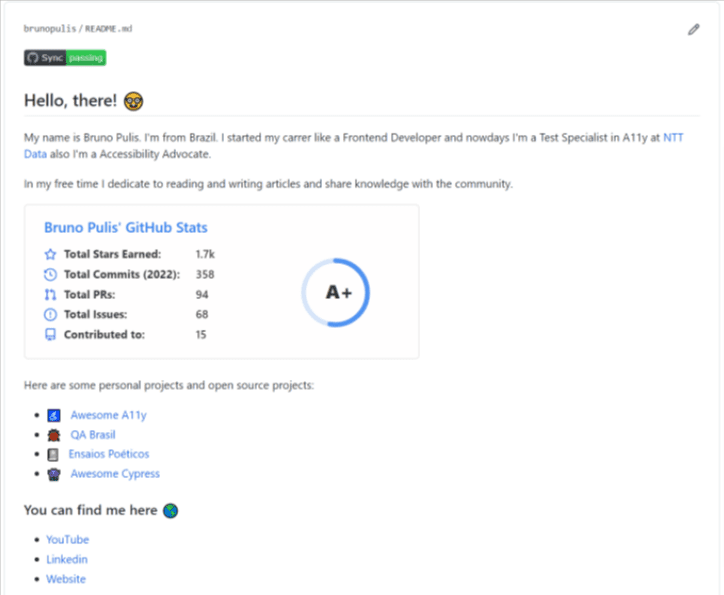

Que o [GitHub](https://github.com) é extremamente importante para a carreira de um desenvolvedor, todos nós sabemos. Mas o que faz um perfil ser relevante e competitivo na rede?

Nesse artigo, te apresento o GitHub Profile, uma ferramenta que pode te ajudar a dar o destaque necessário no seu perfil.

“Além disso, dou algumas dicas para deixar seu GitHub mais profissional

## Criando seu GitHub Profile

Para configurar seu GitHub Profile é simples, crie um repositório com o nome do seu usuário no GitHub, e adicione o arquivo README.md, nele conterá as informações do seu perfil.

O meu perfil ficou assim:

Usei uma estrutura baseada em tópicos, pois é mais fácil de organizar e deixar claro cada sessão. O meu GitHub Profile, está divido da seguinte forma:

- Apresentação
- Status do GitHub
- Projetos pessoais e open source
- Últimos artigos do blog

## Apresentação

Creio que a apresentação é a sessão mais importante e esse é o motivo dela estar em primeiro lugar. Concentre-se em escrever informações relevantes e importantes sobre você.

É interessante colocar alguns fatos como:

- Projetos que trabalhou;
- Projetos que você mantém;
- Passatempos;
- Programas de ação social e voluntariado.

Assim, sua apresentação fica mais completa e pode chamar atenção de recrutadores e desenvolvedores. Quem sabe sua nova oportunidade no mercado não pode partir dai?

## Status do GitHub

Conversando um dia com o [Phiter Fernandes](https://github.com/phiter), ele me mostrou o [GitHub Readme Stats](https://github.com/anuraghazra/github-readme-stats) uma ferramenta para buscar as suas contribuições feitas no GitHub.

Ele consulta as informações através da API do GitHub, e gera um gráfico feito em SVG.

Essa é uma funcionalidade é interessante, pois exibe suas contribuições no Github, isso demonstra seu interesse e incentivo na comunidade de desenvolvimento.

### Configurando

Para configurar o seu GitHub Status, copie o código abaixo, e cole no seu conteúdo markdown.

<https://github-readme-stats.vercel.app/api?username=brunopulis>

Um detalhe importante é trocar para o seu usuário `?username=` pelo nome do seu usuário do GitHub.

## Projetos pessoais e open source

Liste seus projetos pessoais e open source, isso gera notoriedade e destaque aos projetos. Uma dica para quem está começando coloque seus projetos nessa sessão.

Isso irá servir como seu portfólio, no meu perfil existem alguns projetos que mantenho durante muito tempo.

## Contatos e redes sociais

É interessante também manter uma sessão com os seus contatos e redes sociais. Mantenha essa lista atualizada.

Particularmente eu coloquei somente as que atuo com mais frequência, não há necessidade de colocar todas, coloque somente aquelas que você é capaz de responder.

## Listando posts do blog

Essa é uma dica bônus, existe a possibilidade de criar uma integração graças ao GitHub Actions. Ela se baseia em consultar o RSS do seu site e listar os últimos três posts.

Em breve vou escrever como fazer essa integração que é simples e bem legal.

## Conclusão

O GitHub Profile, permite várias possibilidades para deixar seu perfil mais profissional e atraente. Não há limites, basta ser autêntico e criativo.

Na minha pesquisa para esse artigo encontrei uma lista com diversos GitHub Profiles criados. Deixo aqui alguns perfis que achei bem legal.

- [Beto Muniz](https://github.com/obetomuniz)
- [Davidson Fellipe](https://github.com/davidsonfellipe)
- [Marco Vincit](https://github.com/marcovincit)
- [Templates de GitHub Profile](https://github.com/elangosundar/awesome-README-templates)
