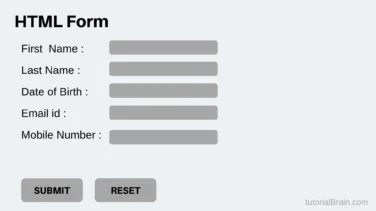
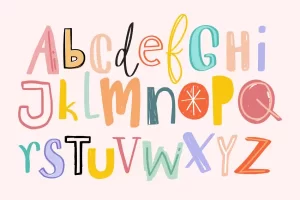

A **acessibilidade web** é um assunto cada vez mais importante para as pessoas interessadas em tornar a internet mais inclusiva. É essencial compreender como criar conteúdo acessível para que todos possam contar com a mesma experiência de navegação.

  
Neste artigo, vamos discutir sobre o que é acessibilidade na web e como você pode tornar seu conteúdo disponível para todos.  
  
Vamos começar?

## O propósito da web

Desde sua fundação, a web tem como propósito ser universal e acessível para todos. Tim Berns-Lee possuí uma frase que exemplifica isso:

> _O poder da Web está em sua universalidade.  
> O acesso por todos, independentemente da deficiência, é um aspecto essencial._
> 
> <cite>Tim Berns-Lee, fundador da web.</cite>

O fato curioso é que as especificações e princípios adotados pela W3C, eram e são extremamente passíveis de serem usados

Um deles é o princípio da **interoperabilidade**, que nada mais é do que sua aplicação conseguir funcionar para todas as pessoas independente do seu hardware, software, idioma, localização ou capacidade.

Quando isso acontece conseguimos incluir pessoas que foram excluídas ao longo de sua vida.  

Dessa forma, as pessoas com deficiência são beneficiadas com o acesso, promovendo inclusão digital e autonomia para realizarem tomadas de decisões.  

Mas para isso ocorrer necessitamos da acessibilidade, **ela é** **essencial para desenvolvedores e organizações que desejam criar sites e ferramentas da web de alta qualidade e não excluir as pessoas de usar seus produtos e serviços.**

## Afinal, o que é acessibilidade na web?

Acessibilidade na web significa que nossos sites e aplicativos estejam preparados para serem acessados por qualquer pessoal, independente de sua necessidade específica.

Esses usuários devem poder perceber, compreender, navegar e interagir com o conteúdo sem restrição.

Ela abrange todas as deficiências que afetam o acesso, incluíndo:

-   auditivo;
-   cognitivo;
-   neurológico;
-   físico;
-   discurso;
-   visual.

## Acessibilidade então é somente para pessoas com deficiência?

Esse é um mito extremamente comum quando somos leigos no assunto. Em uma explicação bem resumida é: **NÃO**.  

Eu escrevi um artigo sobre [5 mitos de acessibilidade: conceitos incorretos e como corrigí-los](https://brunopulis.com/5-mitos-sobre-acessibilidade/), que reforça essa ideia que acessibilidade é para todos.

A acessibilidade traz muitos benefícios para pessoas que não possuem alguma deficiência também, por exemplo:

-   usuários de _smartphones_, _smartwatch_, outros dispositivos inteligentes como assistentes virtuais;
-   pessoas idosas que necessitam de uma nova forma de aprendizado devido a idade;
-   pessoas com deficiência temporárias, por exemplo, alguém que quebrou o braço;
-   pessoas que necessitam ver um vídeo e não conseguem habilitar o aúdio;
-   pessoas com “limitações situacionais”, como enxergar o conteúdo da tela do smartphone contra a luz solar;
-   pessoas que utilizam uma internet com conexão lenta.

## Técnicas para deixar nossos produtos e serviços mais acessíveis

Diversos aspectos da acessibilidade são extremamente simples de serem implementados, outras são mais complexas.

Por isso a acessibilidade deve ser pensando no início do projeto para evitar retrabalho.

### Descreve suas imagens


Imagens são um dos elementos mais utilizados para transmitir informação na web. Dessa forma, devemos permitir que pessoas com deficiência visual possam compreender a informação da mesma maneira que nós.  

Para deixarmos as imagens acessíveis devemos utilizar o atributo `alt` nas imagens. Ele permite que a imagem forneça um texto alternativo equivalente a sua representação visual.  
  
Assim, os não-visuais conseguem compreender o conteúdo da mesma forma.  

Você pode conferir o [Guia Definitivo de texto alternativo](https://brunopulis.com/texto-alternativo-o-guia-definitivo/) que traduzi, nele contém dicas e informações valiosas sobre descrição de imagens.

### Navegação do conteúdo


**Foto de [Clay Banks](https://unsplash.com/pt-br/@claybanks?utm_source=unsplash&utm_medium=referral&utm_content=creditCopyText) na [Unsplash](https://unsplash.com/pt-br/fotografias/PXaQXThG1FY?utm_source=unsplash&utm_medium=referral&utm_content=creditCopyText)**

Quando projetamos conteúdo para web, devemos pensar que as pessoas tem diversos tipos de entrada, como, por exemplo:  

-   navegação através da fala;
-   navegação através do mouse;
-   navegação através do teclado;
-   navegação com leitores de telas.  
    

Todos esses tipos de navegação conseguimos contemplar quando projetamos pensando em várias entradas.  

O que devemos ter em mente: todos os recursos disponíveis via teclado devem estar disponíveis para o teclado.

### Evite o baixo contraste


Contraste é o campeão quando se trata de problemas de acessibilidade. Para garantir um bom contraste podemos utilizar ferramentas como o **Color Contrast Analyzer**.  

Esssa ferramenta analisa o contraste e traz o resultado se possuí um baixo contraste ou não.  
  
Pessoas que possuem daltonismo e baixa visão são extremamente prejudicadas quando não cumprimos isso.  

Nesse sentido, gravei um vídeo usando o Accesible Colors. Ele é uma alternativa para o Color Contrast Analyzer.

<iframe loading="lazy" title="Como validar contraste com o Accessible Colors" width="600" height="338" src="https://www.youtube.com/embed/sGwijH-rVHo?feature=oembed" frameborder="0" allow="accelerometer; autoplay; clipboard-write; encrypted-media; gyroscope; picture-in-picture; web-share" referrerpolicy="strict-origin-when-cross-origin" allowfullscreen=""></iframe>

### Defina rótulos para os formulários



[**Foto de TutorialBrain**](https://www.tutorialbrain.com/html_tutorial/html_forms/)

Um leitor de telas necessita que os _inputs_ de um forrmulário estejam atrelados a um rótulo.  
  
Esse rótulo deve representar o propósito do input.

Para resolver esse problema é extremamente simples, confira o trecho de código abaixo:

```
<label for="firstName">First Name</label>
<input type="text" name="firstName" id="firstName">
```

Com o uso do atributo `for`, criamos um vínculo entre a **label** e o **input.** Dessa forma, quando o leitor de telas navegar pelo campo irá identificar corretamente qual é o seu objetivo de preenchimento.

Pode parecer extremamente trivial, entretanto, é bem comum vermos formulários sem esse atributo.

Minha dica é adota hoje mesmo o uso dos atributos corretos para uma melhor navegação nos seus formulários.

### Defina o idioma da sua página



Talvez esse seja o defeito mais ignorado de acessibilidade. O atributo **lang**, é um aliado extremamente poderoso, contudo poucas pessoas utilizam ele da maneira correta.  

Já escrevi [sobre o uso correto do atributo lang](https://brunopulis.com/usando-o-atributo-lang-corretamente/). Basicamente, precisamos definir o idioma padrão do documento, para que, os leitores de tela e outras tecnologias assistivas possam ler da maneira correta.

## Conclusão

Acessibilidade é um direto de todas as pessoas para promover autonomia e facilidade no assim. Nesse sentido, devemos trabalhar para que os ambientes digitais sejam cada vez mais democráticos e inclusivos.  

Desenvolver um produto ou serviço sem pensar em acessibilidade e dar um tiro no pé.

## Referências

_Algumas informações neste artigo são do documento [Web Accessibility Initiative (WAI): Introduction to Web Accessibility](https://www.w3.org/WAI/fundamentals/accessibility-intro/). [Shawn Lawton Henry](https://www.w3.org/People/Shawn/). Copyright © 2010 W3C® (MIT, ERCIM, Keio). Status: Atualizado em 31 Março de 2022. https://www.w3.org/WAI/fundamentals/accessibility-intro/_