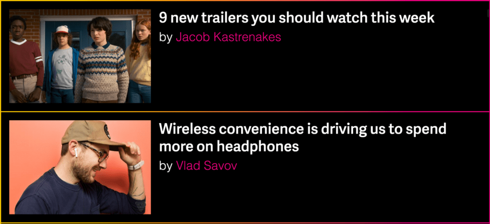
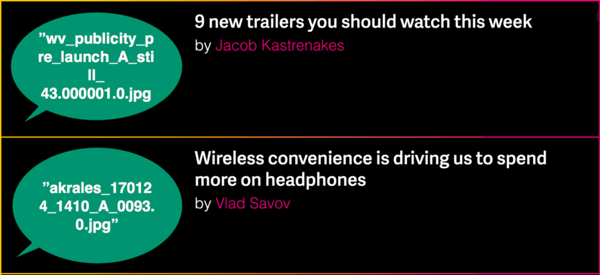
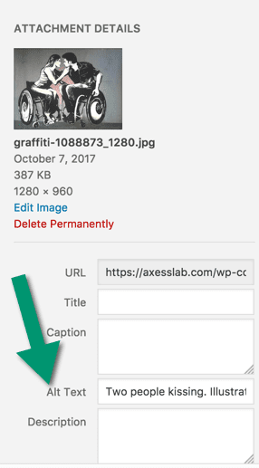
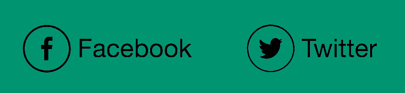
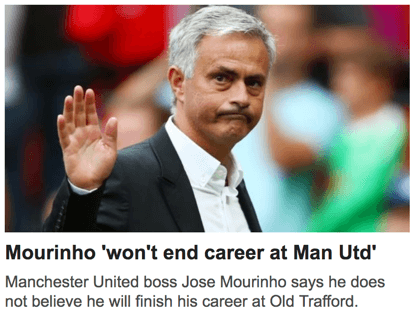

Esta publicação contém tudo o que você precisa saber sobre texto alternativo! Quando usá-los e como desenhá-los perfeitamente. Por mim, Daniel, um desenvolvedor web com deficiência visual que usa um leitor de tela no meu dia-a-dia.

* * *

Texto postado originalmente em [https://axesslab.com/alt-texts/](https://axesslab.com/alt-texts/) escrito por [Daniel Göransson](https://twitter.com/danielgoransson), adaptado e traduzido por Bruno Pulis.

## Minhas experiência com imagens na web

Eu uso uma combinação de [ampliação](https://axesslab.com/make-site-accessible-screen-magnifiers/) e [leitores de tela](https://en.wikipedia.org/wiki/Screen_reader) ao navegar na web.

Como princípio básico, uso ampliação em telas maiores e leitores de tela em dispositivos menores.

Eu, como qualquer um, encontro várias imagens surfando na web. Se eu estiver usando um leitor de tela e depender de obter uma descrição da imagem — o texto alternativo — mostra essa informação.

Muitas vezes o texto alternativo não ajuda, sendo um desperdício do meu tempo porque não transmite qualquer significado.

Deixe-me ilustrar isso na [página inicial do The Verge](https://www.theverge.com/). Isto é o que exibe para pessoas com visão:



Abaixo é o que eu vejo. Eu substituí as imagens com o que meu leitor de tela lê:



Não ajuda muito, não é?

Aqui estão algumas falhas comuns de texto alternativo que encontro:

- “cropped\_img32\_900px.png” ou “1521591232.jpg” — o nome dos arquivos, provavelmente porque a imagem não tem o atributo alt definido.
- “ — em todas as imagens do artigo, provavelmente para melhorar o ranking de busca (SEO).
- “Fotografa: Emma Lee” — provavelmente porque o editor da redação não sabe para que serve um texto alternativo

Os textos alternativos nem sempre são tão ruins, mas geralmente há muito a melhorar. Então, se você é um iniciante ou quer levar o seu “jogo” para o próximo nível, aqui está o nosso guia final para textos alternativos!

## O que é um texto alternativo

Um texto alternativo é uma descrição de uma imagem mostrada para pessoas que por alguma razão não conseguem ver a imagem. Entre outros, textos alternativos auxiliam:

- pessoas com baixa visão ou cegas;
- pessoa que desabilitaram imagem para economizar dados;
- motores de busca (ex: Google, Bing).

O primeiro grupo — pessoas com baixa visão ou cegas — é o grupo que mais se beneficia com os textos alternativos. Eles utilizam algo chamado leitores de tela para navegar na web. Um leitor de tela transforma uma informação visual em fala ou braile. Para fazer isso com precisão, as imagens do seu site precisam ter textos alternativos.

Textos alternativos são super importantes! Tão importantes que o WCAG tem textos alternativos como sua primeira guideline a ser seguida:

> Todo o conteúdo não textual que é apresentado ao usuário tem um texto alternativo com o propósito de ser equivalente.
>
> _– WCAG guideline 1.1.1_

### Como eu adiciono um texto alternativo?

No HTML, um texto alternativo é um atributo em um elemento de imagem:

```html

```

A maioria dos gerenciadores de conteúdo, como WordPress, permite a você criar um texto alternativo quando subir a imagem:



Esse campo geralmente é chamado de Texto Alternativo mas em algumas interfaces é chamado de “descrição da imagem” ou algo similar.

## 6 passos para criar textos alternativos fabulosos

### 1\. Descreva a imagem

Pode parecer óbvio, mas um texto alternativo deve descrever uma imagem. Por exemplo:

“Grupo de pessoas em uma estação de trem.”
“Bebê feliz brincando numa caixa de areia.”
“Cinco pessoas na fila do supermercado.”

As coisas que não pertencem a um texto alternativo são:

- O nome do fotógrafo. Isso é bem comum, mas não faz sentido.
- Palavras chave para SEO. Não preencha o texto alternativo com palavras irrelevantes que você espera classificar no _page rank_ do Google. Não é para isso que os textos alternativos servem e só irá confundir seus usuários.

### 2\. Conteúdo do texto alternativo depende do seu contexto

Como você descreve a imagem depende do seu contexto. Deixe-me dar-lhe um exemplo:


Se essa imagem fosse exibida em um artigo sobre fotografia, o texto alternativo poderia ser algo ao longo das linhas de:

“Close, fotografia em tons cinza de homem em ambiente externo, rosto em foco, fundo desfocado”.

Se a imagem estiver em um site sobre uma série de TV, um texto alternativo apropriado pode ser completamente diferente:

“Estrela do show, Adam Lee, parecendo tenso, lá fora na chuva”.

Então, escreva um texto alternativo que seja o mais significativo possível para o usuário **no contexto em que eles estão**.

### 3\. Mantenha-o conciso

Lendo a sessão anterior, você pode estar pensando consigo: “Eu como um usuário vidente, posso perceber vários detalhes das imagens, como quem é, como é fotografado, tipo de jaqueta, idade aproximada do cara e muito mais.

Por que não escrever um texto alternativo detalhado e longo para que um usuário com deficiência visual obtenha tanta informação quanto eu?

Fico contente por ter perguntado!

Francamente, você pode obter as informações necessárias da imagem num piscar de olhos, e é isso que estamos tentando conseguir, também, para usuários com leitores de tela.

**_Dê as informações necessárias no texto alternativo, mas torne-o o mais curto e conciso possível._**

Uma das poucas vezes que você deve escrever textos alternativos longos é quando você está descrevendo uma imagem contendo texto importante. Idealmente, você não deve ter imagens de texto, mas às vezes você precisa. Como em algumas capturas de tela ou fotos.

Mas a regra geral é mantê-lo conciso e evitar uma experiência prolixa.

### 4\. Não diga isso é uma imagem

Não inicie um texto alternativo com **“Imagem de”**, **“Foto de”** ou similar. O leitor de tela adiciona isso por padrão. Então se você escrever “Imagem de” no texto alternativo, o leitor de tela dirá “Imagem Imagem de…” e bom, isso não é muito agradável.

Uma coisa que você pode fazer é encerrar o texto alternativo afirmando se é um tipo especial de imagem, como uma ilustração.

> “Cão pulando através de um aro. Ilustração.”

### 5\. Finalize com a pontuação

Sempre termine um texto alternativo com pontuação .

Isso fará com que os leitores de tela, utilizem pausas após a última palavra no texto alternativo, o que cria uma experiência de leitura mais agradável para o usuário.

### 6\. Não utilize o atributo **title**

Muitas interfaces têm um campo para adicionar textos no _title_ a imagens próximas de onde você pode adicionar um texto alternativo.

Ignore o texto no atributo title! Ninguém os usa — eles não trabalham em telas sensíveis ao toque e no desktop eles exigem que o usuário passe o cursor sobre a imagem por algum tempo, o que ninguém faz.

Além disso, adicionar um atributo title faz com que alguns leitores de tela leiam o title e o texto alternativo, que se torna redundante. Então, não adicione um atributo title.

## Quando não usar um texto alternativo

Na maioria dos casos você deve usar um texto alternativo para imagens, mas existem algumas execeções onde você deve deixar o atributo alt em branco.

Nota importante: nunca remova o atributo alt, pois irá quebra o padrão html.

Mas você pode defini-lo como uma string vazia, ou seja: **alt=””.** Faça isso nos seguinte casos.

## Imagens repetidas em feeds

Imagine que você está percorrendo seu feed do Twitter. Toda vez que quiser ler um novo tweet, primeiro você deve ouvir “Foto de perfil do usuário <nome de usuário da pessoa que postou>”. Na minha opinião, isso seria super irritante!

Outros exemplos de feeds são:

- Uma lista de links para artigos. Como o da página [Artigos](https://axesslab.com/articles/);
- Chat ou feed de mensagens;
- Feeds de comentários.

Portanto, para uma experiência de usuário ideal, deixe o texto alternativo em branco para imagens que são usadas repetidamente em feeds.

## Ícones em labels

Você [sempre deve ter labels ao lado de ícones](https://axesslab.com/icons-ruining-interfaces/). Supondo que você faça, o ícone não deve ter um texto alternativo. Deixe-me explicar o porquê!

Vamos dar um exemplo de mídia social como exemplo:



Se você escrevesse um texto alternativo para o ícone do Facebook, um leitor de tela diria algo ao longo da linha: **“Facebook Facebook”. Muito redundante!**

OK, isso não é tecnicamente sobre textos alternativos, mas ainda é importante: **certifique-se de que tanto o ícone quanto o texto do link estão no mesmo atributo de link**, para obter uma experiência fluída. Como isso:

```html
<a href="...">
  
  Facebook
</a>
```

Outro erro comum está nos botões de menus:


Se o botão de menu não tiver um label visual — o que, de maneira direta, é realmente ruim para a experiência do usuário, ele precisa de um texto alternativo (ou outra maneira de descrever sua função no código, como aria-label).

Explique a função do ícone, como “Menu”. Não escreva **“Três linhas horizontais”** ou **“Hambúrguer principal”**, que infelizmente são exemplos reais em que eu tropecei.

Se o ícone do menu tiver um label, você deve deixar o texto alternativo em branco. Muitas vezes eu encontro botões de menu que são lidos como “Menu Menu”. Uma vez, encontrei um “menu menu hambúrguer”. Um pouco confuso, não diria?

## Imagens em links

Geralmente, uma imagem com um link é acompanhada com um texto. Como o exemplo abaixo:



Nesse caso, a imagem e o link **devem estar na mesma tag de link no HTML**. Você pode simplesmente deixar o texto alternativo em branco. O importante para o usuário é ouvir o texto do link.

Um texto alternativo da imagem só distrai, adicionando informações que o usuário não achará necessário. A imagem provavelmente é encontrada na página que está vinculada, e então você pode dar uma boa explicação sobre ela no atributo alt.

Se você realmente, precisar ter uma imagem em um link sem um texto de acompanhamento, então o texto alternativo deve descrever o destino do link, e não a imagem.

## Imagens decorativas

De preferência, imagens decorativas que não transmitam nenhum significado ao usuário devem ser colocadas como imagens de fundo em CSS. Provavelmente nem é preciso dizer, mas isso significa que você não precisa de textos alternativos nelas.

Eu classificaria a maioria das imagens em que você coloca texto como decorativas. Você não precisa de um texto alternativo nelas. Um exemplo é a imagem de fundo na página inicial do Netflix:


* * *

## Casos especiais

### Logos no banner

Logos no banner quase sempre ligam para a página inicial do site. As opiniões variam um pouco sobre o tema de textos alternativos para logotipos.

Alguns dizem que deve incluir o nome da empresa, o fato de ser um logotipo e o destino do link. Como tal:

“Axess Lab, logotipo, ir para página inicial.”

Na minha opinião, isso é um pouco detalhado. Muito barulho! Como meu leitor de tela já me diz que é uma imagem e um link, só sinto que preciso ouvir o nome da empresa. Pelo fato de ser uma imagem, suponho que seja um logotipo e, pelo fato de ser um link, suponho que siga as convenções e os links para a página de início.

### SVG

[Gráficos vetoriais escaláveis](https://en.wikipedia.org/wiki/Scalable_Vector_Graphics) (SVG) é um formato de imagem que está se tornando cada vez mais popular na web. E eu amo eles! Eles mantêm sua nitidez enquanto fazem zoom e ocupam menos espaço para que os sites carregem mais rápido.

Existem dois caminhos principais para adicionar um SVG a uma página HTML.

1. Dentro de um elemento img.
    Nesse caso, basta adicionar um texto alternativo como de costume:

```html

```

2\. Usando uma tag **svg**. Se você usar esse método, não pode adicionar um atributo alt porque não há suporte para isso.

No entanto, você pode contornar isso adicionando dois atributos WAI-ARIA: **role=“img”** e **aria-label = “texto alternativo”**.

Na verdade, para o segundo caso, você deve ser capaz de adicionar seu alt-text como um elemento de título no svg, mas não há suporte suficiente para isso em navegadores e tecnologias assistivas no momento.

## O computador não pode fazer isso por mim?

Embora a Machine Learning e a inteligência artificial melhorem rapidamente e possam descrever algumas imagens com bastante precisão, elas não são suficientemente boas para entender o contexto relevante no momento.

Além disso, as máquinas não são suficientemente boas para decidir o que é “conciso”, e muitas vezes descreverão demais ou muito pouco da imagem.

Facebook e Instagram, atualmente incluíram uma feature que descreve imagens automaticamente. Mas eu percebo que as descrições são muito genéricas. Uma imagem no meu feed agora é descrita como: “Gatos dentro de casa”. A foto atual exibe um gato caçando um rato de brinquedo.

Então me desculpe, você ainda deve escrever textos alternativos!

## Obrigado por criar uma web melhor

Estou feliz por você ter lido até aqui! Isso quer dizer que você se importa em tornar a web um lugar melhor para todos os usuários. Compartilhe o conhecimento e continue sendo incrível!
