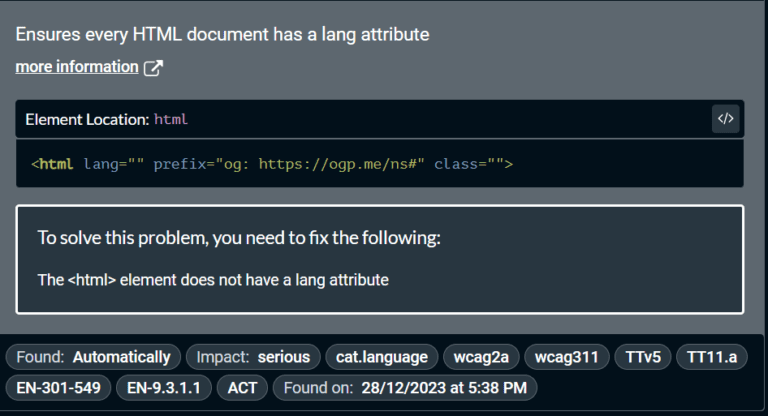

Se você está começando ou já tem experiência com HTML, com certeza já deve ter notado o atributo lang no seu código.

Mas afinal, qual é a utilidade dele?

Nesse artigo, vou te mostrar sua utilidade e importância.

## Índice

-   [Por que isso é importante](#por-que-isso-e-importante)
-   [Quando usar atributo lang?](#quando-usar-atributo-lang)
-   [Conclusão](#conclusao)
-   [Referências](#referencias)

## Por que isso é importante

O atributo `lang` faz parte da família dos atributos globais do HTML, eles podem ser usados sem restrição em quase todos os elementos.

Seu objetivo é fornecer um mecanismo de internacionalização do conteúdo.

Podemos usar de duas formas:

-   **definir o idioma do documento inteiro;**
-   **definir o idioma para partes do documento.**

Podemos definir os idiomas por meio de uma [lista de idiomas](https://www.rfc-editor.org/rfc/bcp/bcp47.txt).

Usando o idioma para o documento inteiro:

```
<!-- um documento HTML em espanhol -->
<html lang="es">
```

Usando para partes do documento:

```
<!-- um documento HTML em espanhol com uma palavra em inglês -->
<p>Acepta su <span lang="en">feedback</span></p>
```

### Qual a relação do atributo lang com acessibilidade?

Na WCAG existem dois critérios relacionados ao idioma:

-   [3.1.1 Idioma da página](https://www.w3.org/WAI/WCAG22/Understanding/language-of-page)
-   [3.1.2 Idioma em partes](https://www.w3.org/WAI/WCAG22/Understanding/language-of-parts)

### Idioma da página

A intenção deste Critério de Sucesso é garantir que os desenvolvedores forneçam informações para apresentar conteúdo textual em outro idioma corretamente.

#### Quem se beneficia?

-   pessoas que usam leitores de tela;
-   pessoas com dificuldade em ler material escrito com fluência e precisão;
-   pessoas com certas dificuldades cognitivas;
-   pessoas que dependem de legendas para mídia sincronizada.

#### Exemplos

Uma página produzida na Alemanha e escrita em HTML inclui conteúdo em alemão e inglês, mas a maioria do conteúdo está em alemão. A língua padrão é identificada como alemão (de) pelo atributo lang no elemento HTML.

```
<!-- um documento HTML com conteúdo em alemão -->
<html lang="de">
```

### Idiomas em partes

Seu objetivo é garantir que o navegador pode apresentar as frases de forma correta. Esse critério apresente o conteúdo considerando:

-   entonação;
-   pronúncia;
-   sotaque;
-   particularidades da língua.

Além disso, os leitores de telas conseguem diferenciar palavras de outro idioma. Fornecendo todas as particularidades do idioma.

**Ponto importante:** essa configuração pode ser desabilitada no leitor de telas.

#### Quem se beneficia?

Todas as pessoas que se beneficiam com o critério 3.1.1 Idioma da página.

#### Exemplos

Um site com internacionalização que possui links para versões da página em outros idiomas (por exemplo, alemão, francês, holandês, catalão, etc.). O texto de cada link é o nome do idioma.

O idioma de cada link é indicado por meio de um atributo `lang`:

```
<ul>
  <li><a href="..." lang="de">Deutsch</a></li>
  <li><a href="..." lang="it">Italiano</a></li>
  <li><a href="..." lang="fr">Français</a></li>
  ...
  <li><a href="..." lang="zh-hant">繁體中文</a></li>
</ul>
```

## Quando usar atributo lang?

O atributo lang deve ser usado sempre, ele é obrigatório.

Use o axe dev tools para validar uma página sem o atributo.



## Conclusão

Percebemos que o atributo é extremamente importante para nossas páginas web e sua implementação é bastante simples. Existem casos em sites multilíngues que o atributo pode ser alterado dinamicamente via linguagens de programação.

Meu conselho é: sempre que iniciar o desenvolvimento de uma página **defina a linguagem** e não tenha esse tipo de problema.

Gostou? Tem alguma dúvida ou sugestão?

Escreva um comentário.

## Referências

-   \[1\] Atributos globais > Lang. Mozilla Developer Network, 2019. Disponível em: [Atributo lang](https://developer.mozilla.org/pt-BR/docs/Web/HTML/Global_attributes/lang). Acesso em: 14 de jan. de 2020.
-   \[2\] 3.1.1 – Language of Page (Level A). WUHCAG, 2019. Disponível em [Language of Page](https://www.wuhcag.com/language-of-page/). Acesso em 14 de jan. de 2020.