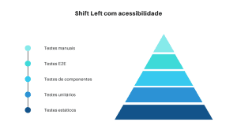
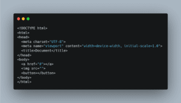
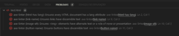

Essa seria somente uma carta, mas decidi dividir em 3 partes.

No final dessas três cartas você vai conseguir montar um processo de teste de acessibilidade de ponta a ponta de maneira pratica e simples.

Hoje vamos explorar um tipo de teste que é ignorado por muitos, mas essencial para a garantia da qualidade: os **testes estáticos**.

---

## Antes, um contexto

Quando você ouve a frase:

> "Precisamos automatizar a acessibilidade", o que vem na sua mente?

Aposto que você pensou vou usar o Cypress com o axe e pronto, vida resolvida.

Bom, pode até funcionar, mas não é a melhor abordagem.

Isso pode trazer problemas como:

- Sobrecarga de responsabilidade dos testes;

- Alto acoplamento;

- Complexidade desnecessária (BDD 🤮).

Eu poderia te dar vários motivos, mas acredito que já são suficientes.

Para ilustrar melhor, vamos pensar na pirâmide de testes.

Os testes E2E estão na ponta dela, ou seja, são mais lentos e caros em comparação as outras abordagens.

Infelizmente, muitas empresas por pressão de gerentes que não sabem nada do assunto optam pelo mais fácil.

Esse mais fácil pode sair mais caro.

Mas como sou seu amigo, vou te mostrar outras alternativas.

## Testes estáticos

Esse tipo de teste é extremamente simples de executar e tem como objetivo:

- Melhoria da qualidade;

- Identificar defeitos;

- Avaliar características como: **legibilidade**, **integridade** e **consistência** do codebase.

Um fato interessante, eles podem ser aplicados tanto para a **verificação** quanto para **validação**.

No contexto de desenvolvimento, pode ser aplicado nas três camadas: HTML, CSS e JS através de ferramentas que conhecemos por _linters_.

Algumas ferramentas como o Sonar e OWASP possuem linters específicos.

No nosso contexto, recomendo usar o [axe Accessibility Linter](https://marketplace.visualstudio.com/items?itemName=deque-systems.vscode-axe-linter#configuration).

O objetivo desse cara é simples: te dedurar se você escrever HTML errado. Ele funciona para:

-  *React* (JSX);

- React Native;

- Angular;

- Vue;

- HTML;

- Markdown.

Quando instalamos ele no editor e escrevo um HTML assim:

Com o linter instalado, o resultado é o seguinte:

>  Por que isso importa? Validar desde o começo vai evitar dores de cabeça no futuro.

Para uma validação mais robusta em componentes React, podemos usar o [eslint-plugin-jsx-a11y](https://github.com/jsx-eslint/eslint-plugin-jsx-a11y).

Algo tem que ficar bem claro:

- Axe Linter: é uma extensão do seu editor de código;

- ESLint Plugin: uma dependência do seu projeto.

Usar os dois é essencial para ter uma dupla validação.

Na próxima carta vamos aprender um outro tipo de teste de acessibilidade.

## Projetos que vale a pena olhar 🧪

- [A11y Automation](https://a11y-automation.dev/automated-tools)

## Artigos interessantes 📖

- [Get your work recognized: write a brag document;](https://jvns.ca/blog/brag-documents/)

- [Front-end development’s identity crisis](https://www.ellyloel.com/blog/front-end-development-s-identity-crisis/).

## O que ando assistindo, lendo ou ouvindo

-  Assisti ontem Duna 2 e adorei.
