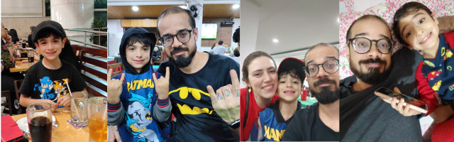

**Petrópolis, 06 de Janeiro de 2024.**

Tenho um sobrinho de sete anos, que em breve, irá se mudar para Portugal.

Ontem, ele continuou fazendo um jogo que inventei durante a semana.

Um RPG maluco com Ninja GO, mas mal sabia que seria uma das nossas últimas brincadeiras. 😥

É curioso como uma criança vem de mansinho e toma o seu lugar.

Até mesmo em mais durões e rabugentos, como eu.

Enquanto redijo esse texto lembro-me de algumas brincadeiras e bobagens que compartilhávamos.

Puxa, como vou sentir saudade desse carinha…

Aquele misto de ansiedade e alegria efusiva pela manhã chamando o Tio Pulis, será trocado por uma casa silenciosa…

Nunca fui bom em despedidas, aliás detesto.

Não fomos criados para nos despedir…

Elas deveriam ser um breve hiato, mas nem sempre são.

Algumas duram a eternidade.

Já com saudade, desejo a você e seus pais o melhor nessa nova fase.

E em breve nos vemos…

