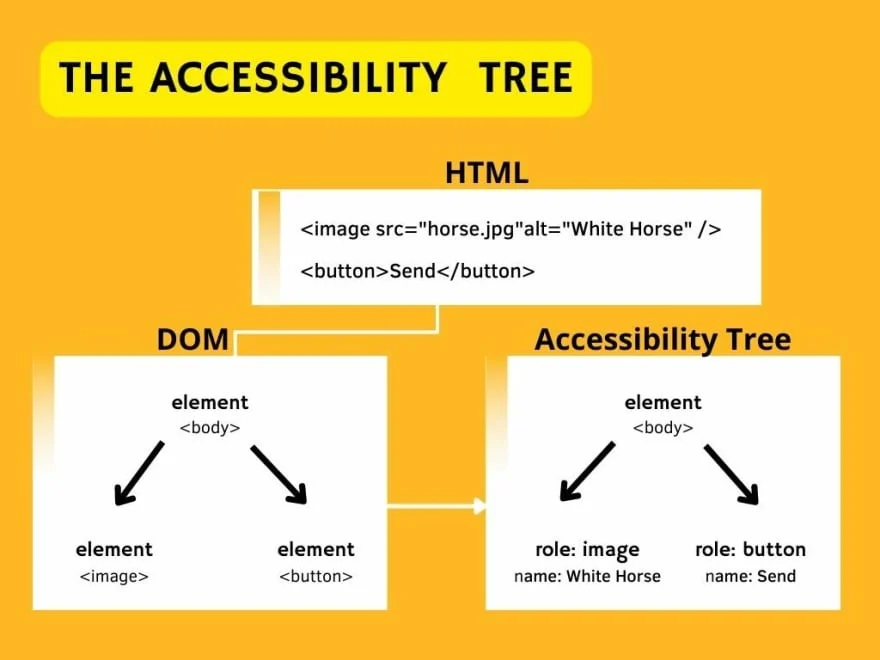

Pulis Letters - Edição #18  
Tempo de leitura: 5 minutos

Alguns dias atrás fiquei pensando sobre as tecnologias assistivas e como ela impactam a vida das pessoas com deficiência.

Sem ela a vida seria deles seriam mais excludente e horrível.

E um detalhe, provavelmente você usa esse tipo de tecnologia e nem sabe, na carta de hoje vamos conversar sobre o uso dessas tecnologias.

Antes de entrar no assunto, tenho uma pergunta:

> Você já se perguntou como pessoas cegas ou com baixa visão usam a Internet?

Não precisa de responder.

Acredito que, a maioria nunca refletiu sobre isso.

A realidade é bem diferente, pessoas cegas ou com baixa visão usam computador e a web em diferentes contextos, como:

- Elas compram produtos e serviços;

- Consomem notícias;

- Navegam na internet.

---

## O que são leitores de tela?

Um leitor de tela é uma tecnologia assistiva usada principalmente por pessoas com deficiências visuais.

Eles fornecem uma saída de áudio e \*braille\* e a maioria possuem indicadores visuais.

Existem diversos no mercado, eles são categorizados em:

\* Leitores para desktop e notebook;  
\* Leitores para smartphones.

Cada leitor da suporte para um sistema operacional, atualmente temos:

- Orca para Linux;

- NVDA para Windows (open source e gratuito);

- Narrator (nativo do Windows);

- JAWS para Windows (pago);

- Talkback (Android);

- VoiceOver para iOS.

O mais usado para Windows é o NVDA.

Por quê isso importa? Um leitor de telas não fica restrito a pessoas com deficiências visuais, pessoas com: dislexia, autismo e outras necessidades específicas podem usar.

## Como o leitor de tela funciona?

Os leitores de tela, usam as API's de acessibilidade do sistema operacional para analisar e ler a interface para o usuário.

No exemplo acima, quando um leitor lê um documento HTML, ele analisa *accessibility tree*, ela é semelhante a árvore do DOM.

Mas nem tudo são flores, cada sistema operacional fornece uma API de acessibilidade específica.

Isso me lembra a famosa **browser wars**. Sua leitura pode ser diferente entre sistemas operacionais e navegadores.

> **Por quê isso importa?** *Escrever um HTML semântico contribui para uma leitura mais limpa e concisa. Já um HTML mau escrito, traz muitos problemas.*

Para diminuir esses problemas os fornecedores de leitores de tela recomendam navegadores mais compatíveis.

Você pode [ver nessa lista o suporte de features de acessibilidade](https://html5accessibility.com/) para cada navegador.

Os leitores possuem alguns tipos de navegação:

- Navegação tabular;

- Navegação por modo de foco;

- Navegação rápida.

### Navegação tabular

Esse tipo de navegação é realizado com a tecla **Tab** ou **Shift + Tab**. Tem o objetivo dar foco aos elementos que são **interativos**, como:

- Links;

- Botões;

- Campos de formulário.

### Modo de foco

Esse tipo de navegação permite maior liberdade e flexibilidade na navegação, usada quando queremos explorar a página ou realizar a leitura de itens específicos como tabelas.

### Navegação rápida (atalhos)

A navegação por atalhos geralmente é usada por usuários avançados ou que estão familiarizados com um determinado site.

Esse tipo de usuário quer agilidade na navegação, logo a navegação tabular ou por setas não faz muito sentido.

O NVDA possuí diversos atalhos para esse tipo de navegação, irei listar os atalhos mais comuns:

<table class="has-fixed-layout"><tbody><tr><td><b>Tecla de atalho</b></td><td><strong>Ação executada</strong></td></tr><tr><td>B</td><td>navega nos botões disponíveis na tela</td></tr><tr><td>K</td><td>navega através de todos os links da tela</td></tr><tr><td>L</td><td>navega nas listas disponíveis</td></tr><tr><td>H</td><td>
<table class="mlContentTable" role="presentation" border="1" width="100%" cellspacing="0" cellpadding="0" align="center" bgcolor="#ffffff"><tbody><tr class=""><td width="50%">navega pelos títulos.</td></tr></tbody></table>
</td></tr></tbody></table>

Você pode conferir todos os atalhos [na lista de atalhos do NVDA](https://dequeuniversity.com/screenreaders/nvda-keyboard-shortcuts).

---

## Sou desenvolvedor, porque devo me importar?

Como desenvolvedores, devemos garantir que nossas entregas estão de acordo com os padrões web.

Navegar com o leitor de telas vai trazer efeitos positivos como:

- escrita correta do HTML;

- Identificar a ordem de declaração dos elementos;

- Aproximar a experiência real;

- Dar previsibilidade em bugs de acessibilidade.

Escrevi [um artigo que pode ser útil](https://brunopulis.com/5-motivos-para-usar-leitor-de-telas/) para você.

Espero que essa carta te ajudou de alguma forma. Se sim?  
Compartilha esse post com quem precisa.

Abraços,  
Pulis.  
Soli Deo Gloria.
