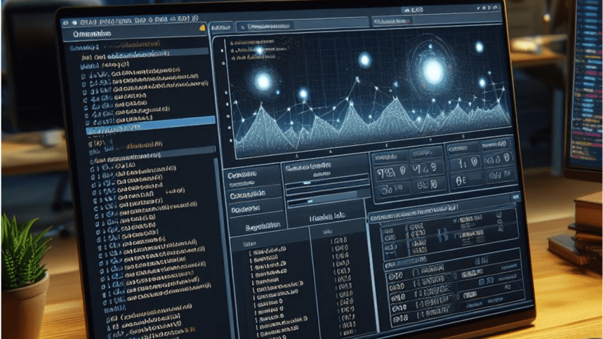
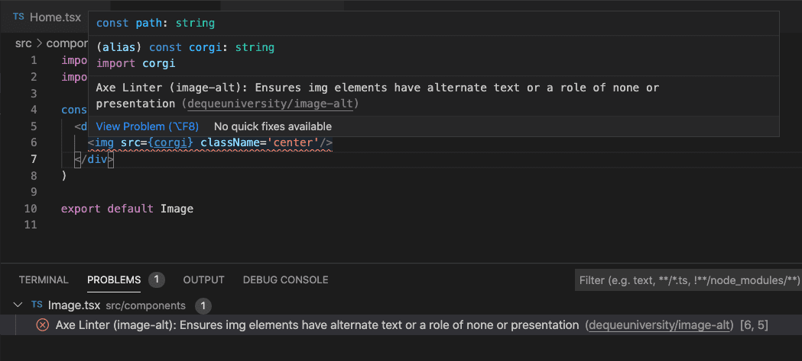
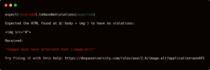

 _Imagem gerada com o Bing Create, prompt: teste automatizado._\[/caption\]

Semana passada, vi uma apresentação sobre **_shift left_ com acessibilidade** que me chamou minha atenção.

Para quem não conhece o termo, shift left é uma abordagem para garantir a qualidade desde o início. Isso traz diversos benefícios, dentre eles:

- Prevenir bugs;
- Antecipar melhorias;
- Gerar previsibilidade e agilidade;
- Aumentar a confiança do time.

De forma prática, vou te mostrar:

- Ferramentas;
- Abordagens;
- Algumas dicas.

\[caption id="attachment_6706" align="aligncenter" width="760"\] Pirâmide de testes usando Shift Left de acessibilidade\[/caption\]

> Observação: nossa jornada irá seguir uma pirâmide que faz uma analogia com a famosa pirâmide de testes. Vale lembrar, que ela não é uma representação real da pirâmide de testes.

Vamos lá.

---

### A informação n°1: O teste de acessibilidade automatizado substitui o teste manual?

**Não**, precisamos deixar isso bem claro. Os testes automatizados são apenas um complemento para uma cobertura maior.

A [Deque](https://www.deque.com/), fez algumas pesquisas e concluiu que: [57% dos problemas de acessibilidade podem ser detectados em testes automatizados](https://www.deque.com/automated-accessibility-testing-coverage/).

### Etapa 0: Testes estáticos

Investir tempo em testes estáticos é muito importante. Nessa etapa, podemos encontrar possíveis problemas que seriam identificados lá na frente.

Recomendo usar o [axe-linter](https://marketplace.visualstudio.com/items?itemName=deque-systems.vscode-axe-linter), ele pode ser integrado com o VSCode e detecta problemas em tempo real.

Imagine o cenário, você esta escrevendo um componente de imagem e esquece o atributo ALT.



O axe-linter emite um alerta informando onde ocorreu o erro e como corrigi-lo.

Além disso, ele permite customizar as regras. Basta definir nas suas configurações.

### Etapa 1: Testes unitários

Devemos investir em vários cenários de testes unitários pensando em acessibilidade. Isso irá contribuir para uma abordagem mais robusta.

São testes extremamente objetivos e rápidos de executar.

Uma ferramenta que pode ser utilizada é o [jest-axe](https://github.com/nickcolley/jest-axe). Ele é um _custom matcher_ para Jest que inclui validações de acessibilidade.

Um exemplo de um componente `` sem o atributo ALT inserido.

```javascript
/**
 * @jest-environment jsdom
 */
const { axe, toHaveNoViolations } = require("jest-axe");
expect.extend(toHaveNoViolations);
it("deve demonstrar o uso do matchesr", async () => {
  const render = () => '';
  // pass anything that outputs html to axe
  const html = render();
  expect(await axe(html)).toHaveNoViolations();
});
```

O resultado da asserção seria:



O jest-axe não é a única solução existem diversas, como:

- [React Testing Library](https://testing-library.com/docs/react-testing-library/intro/);
- [Vue Test Utils](https://test-utils.vuejs.org/);
- [Vue Testing Librar](https://testing-library.com/docs/vue-testing-library/intro/);
- [Nx](https://nx.dev/).

### Etapa 2: Testes de componentes

Para ilustrar, vamos pensar em um componente de modal. Ele tem diversos comportamentos específicos como:

- Leitura do conteúdo em telas pequenas, deve ser de 100% da tela;
- Foco inicial deve ser no primeiro elemento focalizável da tela;
- Definir o foco inicial quando a modal abrir.

Deu pra pegar a ideia? Existem diversos cenários, além disso, devemos validar o suporte ao teclado.

Utilizo para esse tipo de teste o [Cypress focado nos componentes](https://docs.cypress.io/guides/component-testing/overview).

Nesse componente devemos ter o suporte de teclado:

- Tab: deve mover o **foco para o próximo elemento focalizável** dentro da modal;
- Shift + Tab: deve mover o foco para o **elemento focalizável anterior** dentro da modal;
- Esc: deve permitir fechar a modal.

### Etapa 3: Testes E2E

Os testes E2E auxiliam para identificar possíveis problemas na jornada do usuário. Quando pensamos nessa abordagem de shift left, o E2E cumpre somente o papel de validar os passos do usuário.

Para esse teste utilizo o [Cypress](https://www.cypress.io/) outro interessante é o [Playwright](https://playwright.dev/).

**É muito importante não sobrecarregar o E2E com outras responsabilidades**. É bem comum sobrecarregar ele com testes de componentes.

Devemos usar o teste E2E com sabedoria, geralmente eles são interessantes em:

- fluxos principais;
- jornadas críticas;
- fluxo de alto valor.

### Etapa 4: Testes manuais

No início comentei sobre o valor dos testes manuais. Ele é importante pois valida a experiência real de pessoas com necessidades especificas.

Esses testes são realizados por usuários de leitores de tela, avaliamos coisas como:

- Leitor de telas;
- Zoom;
- Compreensão textual;
- Palavras incomuns;
- Contraste textual e não textual;
- Identificação consistente.

Não adianta ter uma abordagem bonitinha, mas a experiência final ser uma bela de uma porcaria.

**Resumindo:**

- Use testes estáticos com o axe-linter;
- Crie testes unitários, com o jest-axe ou alguma Testing Library;
- Teste isoladamente os componentes com seus comportamentos específicos;
- Sabedoria ao usar os testes E2E, pequeno gafanhoto;
- Abuse dos testes manuais.

Gostou dessa edição? Adoraria saber sua opinião.

SDG,

Bruno Pulis.
