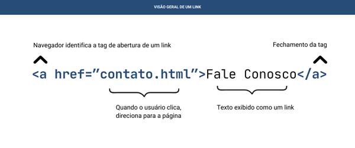

Os links são um dos pilares fundamentais da web desde a sua criação por Tim Berns-Lee no CERN em 1989. São conhecidos também como hiperlinks e revolucionaram como interagimos com os conteúdos na web.

O WWW (World Wide Web) nasceu como um sistema de informação para resolver um desafio específico no CERN - a Organização Europeia de Investigação Nuclear.

O problema era complexo:

> _**Como armazenar, atualizar e encontrar documentos em um ambiente dinâmico? Além de distribuí-los para colaboradores externos?**_

A solução pensada foi criar uma forma de conectar os documentos diretamente no texto.

Os links, permitem que qualquer pessoa navegue em diferentes documentos e recursos.

Isso estabeleceu as bases da web moderna, onde bilhões de página estão conectados por links.

Nas próximas seções, vamos explorar:

- Como criar links;

- Como garantir a acessibilidade;

- Dicas para _copywriters_.

Vamos lá!?

---

## Como criar links?



O elemento `<a>` com o atributo `href` cria uma hiperligação em algumas situações, como:

- Páginas web;

- Arquivos;

- Endereços de e-mail;

- Ligação na mesma página;

- Endereços de URL.

Ele pode receber diversos atributos como: `download`, `href`, `hreflang`, `ping` , `referrerpolicy` , `rel`, `target` e dentre outros.

Sua estrutura básica é formada como no código abaixo:

```markup
<a href="contato.html">Fale conosco</a>
```

Esse exemplo não possui nenhum problema, todos os elementos necessários estão presentes.

Mas nem tudo são flores, é muito comum vermos exemplos, como:

```markup
<a href="<https://twitter.com/obrunopulis>">
  <i class="fa fa-twitter"></i>
<a>
```

Esse tipo de abordagem pode dificultar bastante a experiência do usuário.

> **Para memorizar**  
> O conteúdo em um link deve indicar seu destino, mesmo descontextualizado.

## Como garantir acessibilidade?

Para garantir a acessibilidade um link, devemos seguir os dois critérios da WCAG:

- [2.4.4 Finalidade do Link (em contexto) Nível A](https://www.w3.org/TR/WCAG21/#link-purpose-in-context);

- [2.4.9 Finalidade do Link (apenas link) Nível AAA](https://www.w3.org/WAI/WCAG22/Understanding/link-purpose-link-only).

---

Vamos imaginar um exemplo, uma sessão de um blog contendo as três últimas postagens.  
Cada uma com um link de **“Leia o texto”**, qual o problema com essa abordagem?


Pessoas que utilizam leitores de telas podem navegar por atalhos, e um deles são os links.

Nesse cenário, ela não teria contexto do que o **“leia o texto”** indica, a primeira pergunta seria **“leia o texto, mas qual texto?”**

Para resolver esse problema, podemos optar por três abordagens:

- Modificar o texto do link para dar maior compreensão do contexto;

- Adicionar um atributo aria para complementar a informação;

- Inserir uma informação somente para o leitor de telas.

Vamos explorar essas abordagens:

### Modificar o texto do link

Nem sempre essa abordagem é possível, mas se você tiver liberdade pode modificar o texto “Leia mais”, por algo mais contextual.

Por exemplo:

- **Leia o texto sobre as medalhas olímpicas.**

### Adicionar um atributo ARIA

Uma solução que pode ser elegante é o uso do atributo, `aria-label` ele funcionará como um complemento do link.

Podemos fazer algo como:

```markup
<a href="noticia-1.html" aria-label="Leia o texto sobre as medalhas olímpicas">
  Leia o texto
</a>
```

O atributo aria-label, irá sobrescrever o conteúdo textual “Leia o texto”. O usuário de leitor de telas irá escutar a seguinte informação: **leia o texto sobre as medalhas olímpicas.**

Atributos ARIA devem ser a última opção, somente em caso extremamente necessários.

### Inserir informação sobre para o leitor de telas

Essa abordagem é a minha preferida e menos instrutiva que a anterior.

Com essa técnica o conteúdo visual permanece “Leia o texto”, porém, o leitor de telas recebe um contexto.

A solução seria:

```markup
<a href="noticia-1.html">
   Leia o texto
   <span class="visually-hidden">sobre as medalhas olímpicas</span>
</a>
```

Usamos um elemento <span> dentro do link com uma classe que oculta a informação visualmente e disponibiliza somente para o leitor de telas.

**Elegante, chique e rebuscada.**

Com poucos ajustes conseguimos disponibilizar informações equivalentes para todos.  
**Viva a acessibilidade.**

## Dicas para copywriters

Como tinha dito no início dessa edição, vou dar algumas dicas para meus amigos copywriters.

Ao redigir um texto publicitário para um lançamento, _landing pages_, anúncios ou até uma newsletter lembre-se:

Evita ao máximo as iscas e ganhos para links, como:

- “Saiba mais”;

- “Clique aqui”;

- “Veja aqui”.

O link deve ser autoexplicativo, ou ter um contexto. Dessa forma, garantimos a acessibilidade para todos.

São Ogilvy agradece e os milhares de brasileiros com algum tipo de deficiência também.

E lembre-se, usamos acessibilidade todos os dias só não percebemos.

Por hoje é só, espero que essa carta te ajude de alguma forma.

P.S: Compartilhe seu trecho favorito com @brunopulis no Instagram e me conte o que achou!

P.S.S.: em breve irei lançar um novo produto, fiquei de olho.

Grande abraço,  
SDG.  
Pulis
