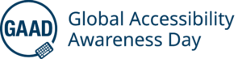

## Dia Mundial de Conscientização da Acessibilidade

Hoje, celebramos o Dia Global de Conscientização sobre Acessibilidade (GAAD).

**Seu objetivo é:**

> **_Fazer com que todos falem, pensem e aprendam sobre acesso/inclusão digital e pessoas com diferentes deficiências._**

Atualmente, temos diversos materiais para estudar e conhecer esse universo inexplorado.

Não existe desculpa, aliás, nunca existiu desculpa para construir produtos/serviços inacessíveis.

A acessibilidade não é novidade, existe desde os anos 80. A WCAG existe há 25 anos, seu objetivo é deixar o conteúdo da web disponível para todas as pessoas.

Existem dois aspectos importantes na acessibilidade:

- Direito ao acesso à informação;

- Autonomia das pessoas.

Convivendo com pessoas com deficiência você aprende muito em pensar no próximo.
Imagina se você precisasse de alguém para te auxiliar a:

- Pagar contas;

- Escolher produtos;

- Comprar ingressos;

- Terminar um cadastro;

- Comprar um curso;

- Passar por biometria facial.

Pois é, esses desafios são diários e muitas vezes eles acabam desistindo de fazer sozinhos e precisam de ajuda de alguém.
Outras vezes, simplesmente desistem de uma compra.

**Percebe que acessibilidade é muito mais, do que o tutorial de fulano ensinando a colocar um ALT em uma imagem?**

## A Web está doente!

Já pensou em quantos sites ao redor do mundo são inacessíveis? Para se ter uma noção, segundo estudos, menos de um 1% dos sites brasileiros são acessíveis.

Quantas oportunidades perdidas!

O Web AIM, um site especializado em acessibilidade, publica anualmente uma pesquisa sobre o estado da acessibilidade mundial.

Você pode [conferir a pesquisa na íntegra](https://webaim.org/projects/million/).

A tabela abaixo demonstra os problemas mais comuns de acessibilidade encontrados.

### Erros comuns em websites

\[table type="responsive" border=true" cols="Falha WCAG, % em 2022, % em 2023, % em 2024 " rows="Baixo contraste, 83.9%, 83.6%, 81% | Imagens sem ALT, 55.4%, 58.2%, 54.5% |

Links vazios, 49.7%, 58.2%, 48.6% | Forms sem label, 46.1%, 45.9%, 44.6% | Botões vazios, 27.2%, 27.5%, 28.2% | Documentos sem idioma, 22.3%, 18.6%, 1 7.1%" \]

Já escrevi um [artigo comentando sobre esses erros](https://brunopulis.com/6-maiores-erros-de-acessibilidade-digital) e como corrigi-los.

## Conclusão

Temos um longo caminho pela frente, mas não perco as esperanças.
Se você está nessa newsletter, já um ótimo sinal!

Você pode ser um agente de transformação dessa realidade.
Juntos somos mais fortes e podemos contribuir para uma web acessível e democrática.

**PS: Se você quer aprender de verdade, marque um horário comigo.**
**PS 2: Estou finalizando os ajustes para lançar minha mentoria, o Acessibilidade PRO.**

Em breve abrirei as vagas.

## Para se aprofundar

- [WebAIM: The WebAIM Million](https://webaim.org/projects/million/)

- [Menos de 1% dos sites brasileiros são considerados acessíveis](https://forbes.com.br/forbesesg/2021/07/menos-de-1-dos-sites-brasileiros-sao-considerados-acessiveis-diz-pesquisa/)
