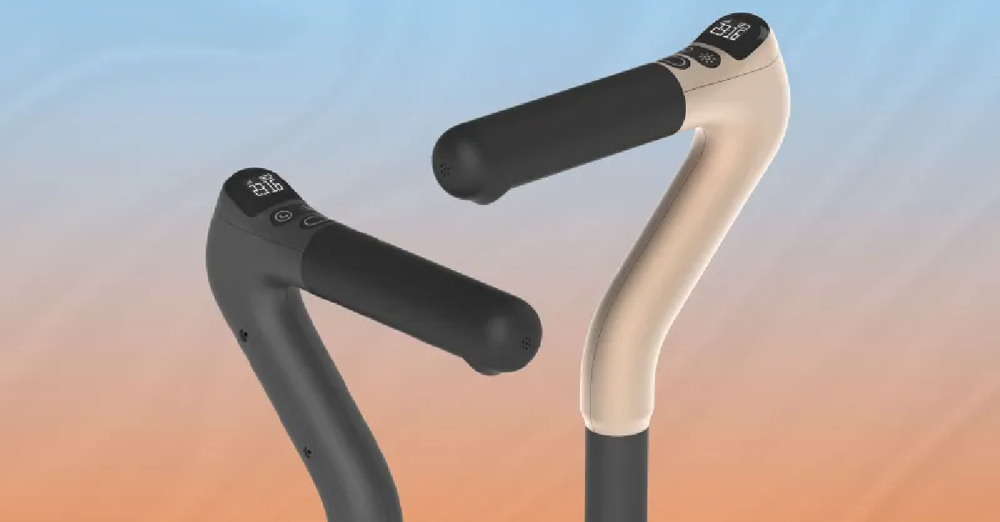
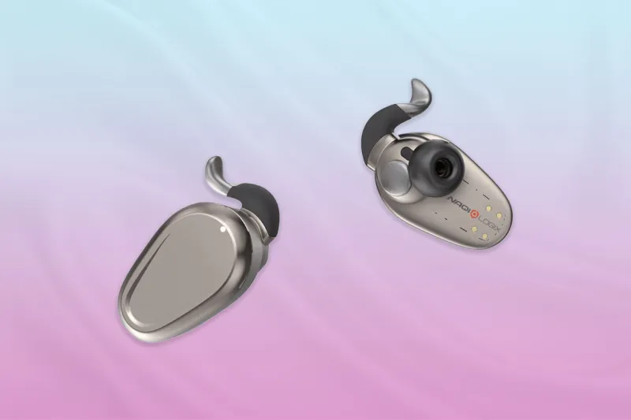
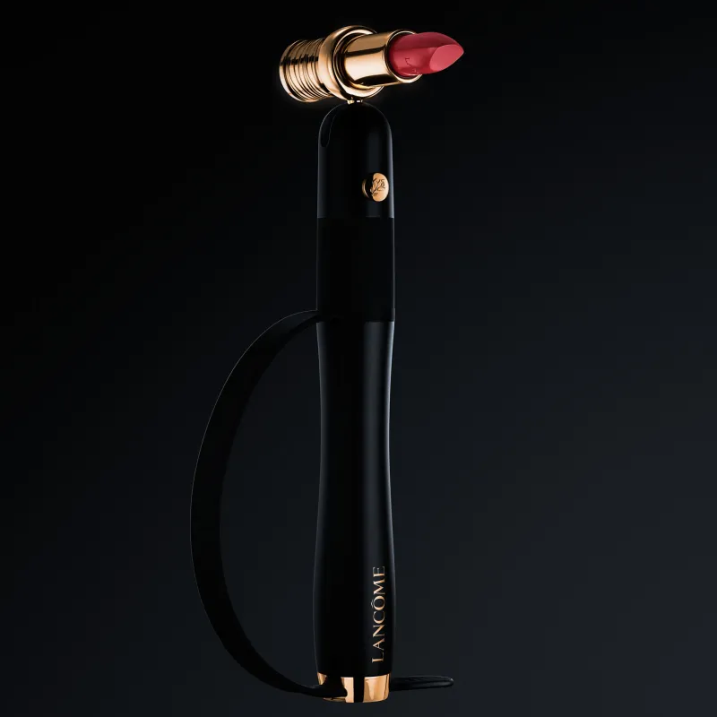
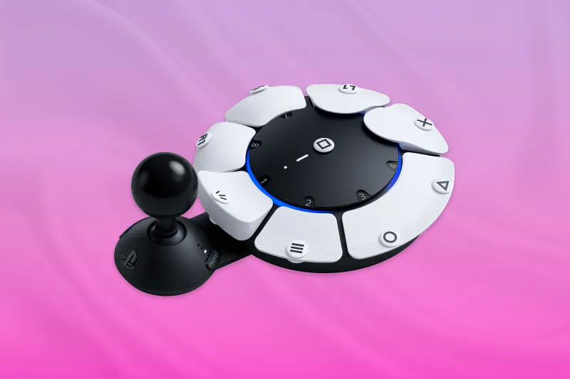
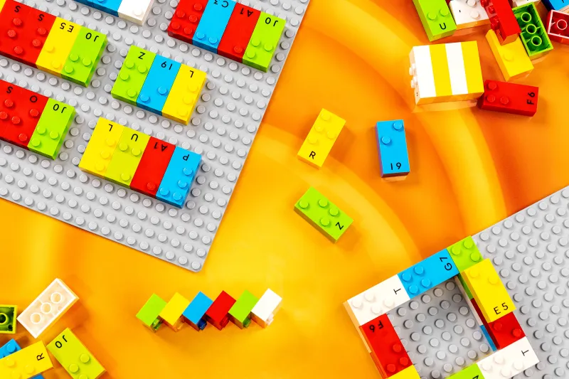
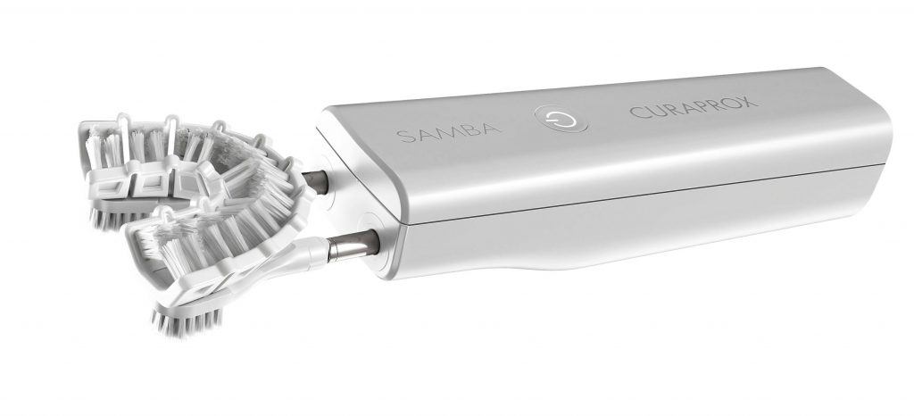
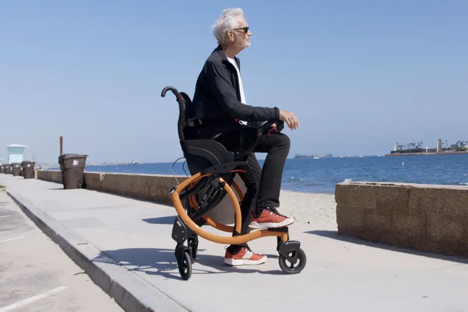

_**19 de Novembro de 2023**_ Recentemente li um artigo da revista Time, nele foram listados as melhores invenções acessíveis de 2023. Essa lista contém 200 invenções para 2023, mas me chamou a atenção a categoria de **acessibilidade**. Na carta de hoje irei aprofundar em cada invenção voltada para esse tema.

## Bengala Inteligente

<table><tbody><tr><td></td></tr></tbody></table>

De acordo com dados do [CDC](https://www.cdc.gov/falls/data/index.html#:~:text=Falls%20am....) (SUS americano), são gastos **50 milhões de dólares** com custos médicos relacionados a pessoas idosas que tomam uma queda.

No Brasil, 40% dos idosos com 80 anos ou mais sofrem algum tipo de queda.

A bengala inteligente é um projeto da empresa [Can Go](https://can.co/).

Ela é integrada com uma inteligência artificial e possui as seguintes funcionalidades:

- Chamada de voz integrada;

- Localização e GPS;

- Lanterna acoplada na bengala;

- Design ergonômico e moderno;

- Crie metas de caminhada e acompanhe seus resultados;

- Relatórios de saúde via aplicativo;

- Facilidade de recargar.

O produto é comercializado somente nos EUA e Canadá por enquanto. Dei uma pesquisada rápida e na Best Buy a bengala custa **300 dólares**.

Algo fora da realidade para o brasileiro comum.

O vídeo abaixo demonstra todas as funcionalidade citadas:

## Neural Sleeves

A Neural Sleeves, foi o resultado de uma pesquisa de um pai desesperado para dar uma condição de vida melhor para sua filha, que possui paralisia cerebral.

O projeto começou a ser comercializado em janeiro de 2022 com a aprovação da FDA.

Ele analisa em tempo real os sensores no tecido, em seguida, envia sinais elétricos para provocar contrações musculares direcionadas para as pernas.

Achei interessante que pode ajudar diversas pessoas como:

- pessoas com paralisia cerebral;

- veteranos de guerra;
- pessoas com atrofia muscular;

Um ponto negativo: no site deles não fica muito claro as informações e isso dificultou pesquisar de modo mais profundo.

Outro ponto interessante é a personalização do tratamento via aplicativo disponível em iOS e Android.

## Fone de ouvidos neurais

<table><tbody><tr><td></td></tr></tbody></table>

Esses fones de ouvido tem a premissa de dar autonomia para pessoas tetraplégicas.

Basicamente, envia sinais elétricos a partir de gestos da mandíbula ou levantando uma das sobrancelhas, o gesto é transformado em comandos pelo aparelho e os usuários ouvem uma voz para ajudar a navegar na interface invisível.

**_Ainda está em fase de desenvolvimento e pode ser usado para:_**

-  controlar cadeiras de rodas;

- itens domésticos inteligentes _(wearables)_.

## Lancôme Hapta

<table><tbody><tr><td></td></tr></tbody></table>

O HAPTA by Lancôme é o primeiro dispositivo de maquiagem inteligente, ultra preciso e portátil do mundo. Ele é um suporte que usa a tecnologia de estabilização e se adapta aos usuários.

Dessa forma, provê maior inclusão e autonomia para as pessoas.

Segundo Guive Balooch, diretor-gerente global da L'Oréal **_"nenhuma comunidade deve ser removida da capacidade de usar produtos de beleza."_**

## Sony Access Controller for PS5

<table><tbody><tr><td></td></tr></tbody></table>

Segundo pesquisas, mais de um terço da população mundial joga videogames, mas infelizmente a participação de pessoas com deficiência ainda é um desafio.

Cerca de 16% da população vive com uma deficiência significativa.

Por isso a Sony desenvolveu o Access Controller para PS5, um kit personalizável.

Ele apresenta um joystick com 22 componentes que podem ser trocados e configurados em vários layouts e combinados com outros acessórios para atender diferentes necessidades dos gamers.

**Hideaki Nishino**, vice-presidente sênior da Sony Interactive Entertainment, diz que a criação do dispositivo envolveu cinco anos de pesquisa e desenvolvimento juntamente com experts em acessibilidade.

## Colete tatéis

<table><tbody><tr><td></td></tr></tbody></table>

_**Concertgoers wear haptic suits created for the deaf by Music: Not Impossible, during an outdoor concert at Lincoln Center in New York City on July 22, 2023. Angela Weiss—AFP/Getty Images**_

O colete tátil ou traje háptico, é um tipo de mochila que a pessoa veste, com alguns acessórios.

Basicamente ele traduz o áudio em vibrações para pessoas surdas sentirem a música na pele, por assim dizer.

Essa é uma possibilidade muito interessante para pessoas surdas poderem desfrutar da música.

Recentemente, vi o Whindersson Nunes comentando sobre esse traje, ele utilizou em um dos seus shows no Rock n Rio em parceria com a TRON Ensino de Robótica Educativa, Dr. Gildário Lima, Maria Rita Alcafor e o influencer Alex Júnior.

Vale a pena ver o vídeo e ver a emoção estampado em seus rostos. ❤

## Brincando com Braille

<table><tbody><tr><td></td></tr></tbody></table>

_**Elizabeth Renstrom for TIME**_

Lembro quando era criança amava brincar com Lego, tenho alguns legos do Star Wars. A proposta do \*Lego Braille Bricks\* é fornecer um material de aprendizado do braille para crianças com deficiência visual. A forma lúdica de aprender brincando facilita a retenção de conhecimento. Anteriormente esse lego era somente para escolas e outras instituições de ensino. Porém, essa realidade está mudando e agora o produto está disponível para o público em geral, por enquanto, somente em inglês e francês. Todas as peças são compatíveis com os produtos Lego, um ponto interessante são as adaptações das peças para aprender braille. Dessa forma, não perde sua funcionalidade e ainda dá a oportunidade de conhecer outro sistema de escrita. Segundo Rasmus Logstrup Jensen, líder criativo da Lego as peças foram desenvolvidas para todos, para que até mesmo crianças videntes e familiares possam mostrar seu interesse em aprender braille.

## Samba Robotic Toothbrush

<table><tbody><tr><td></td></tr></tbody></table>

Steffen Mueller trabalha a mais de 20 anos na indústria de cuidados e prevenção bucal. Ele detectou que pessoas com deficiência sofrem com um mal atendimento e por consequência quase 88% sofrem de cáries.

Para resolver esse problema foi desenvolvida a **Samba Robotic Toothbrush**, uma escova em formato de U e 12.900 cerdas macias. Ela se move ao redor da linha da gengiva e oscila em frequências altas e baixas para cobrir todos os dentes.

O valor dela no site da Curaprox é de **200 dólares**.

O vídeo abaixo é muito interessante.

## Zeen dispositivo de mobilidade

<table><tbody><tr><td></td></tr></tbody></table>

O Zeen é um dispositivo de mobilidade que permite pessoas andarem de forma mais segura.

Ele utiliza uma tecnologia de mola a gás do inventor Garrett Brown que desenvolveu ao criar o estabilizador da câmera de cinema Steadicam em 1970.

Ele permite que os usuários movam suavemente a cadeira para cima e para baixo, para que possam alternar mais facilmente entre os modos caminhar, ficar em pé e sentar.

O preço é extremamente caro no site da [Zeen](https://gozeen.com/collections/shop-all/products/the-zeen) custa em média $3.980 dólares.

## Para concluir

Vejo um movimento muito interessante de alguns setores da sociedade em prol da acessibilidade.

Outros tiveram um avanço tímido pós-pandemia, como no caso de produtos digitais.

Minha esperança é que cada vez mais a sociedade se conscientize que \*\*acessibilidade é para todos\*\*.

Essa semana fiz [um post no Instagram contando a nossa experiência em organizar o nosso casamento acessível](https://www.instagram.com/p/Cztjx9UuutQ/?utm_source=ig_web_c...).

Corre lá pra ver e se você não me segue, siga imediatamente 🤣.

O que achou desse e-mail? Adoraria saber sua opinião.
