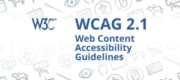
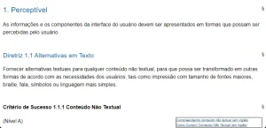

Pulis Letters - Edição #24  
Tempo de leitura: 3 minutos



Esses dias me peguei lembrando do meu primeiro contato com a **WCAG**.

Foi uma experiência digamos, um tanto quanto assustadora. 🤣

Foi mais ou menos assim: abri o site, vi uma documentação extensa pra caramba, chata e com conteúdo bem técnico.

Na época não existia a tradução para português e mal mal tinha o Google Translate. ChatGPT nem sonhava em existir.

Foi na cara e na coragem!

E cá pra nós: **ler documentação é um saco**.  
São poucos produtos que tem uma documentação que dá gosto de ler, infelizmente a WCAG não um deles.

Mas, vejo alguns movimentos da W3C para melhorar o documento.

Voltando as minhas lembranças, assumi um compromisso de lê-la. Fiz esse processo várias vezes e ficou uma pergunta no ar: **como vou usar isso no dia a dia?**

Precisava de algo concreto, tinha que fazer sentido.  
Hoje sofremos com isso, muito conteúdo abstrato que não reflete a realidade.

Como resolvi isso?

Foquei meus esforços em compreender um critério de sucesso, explorar as técnicas e procurar exemplos. E aquilo que era abstrato, começou a ficar concreto na minha cabeça.

E o tempo me provou que a WCAG é vital para o desenvolvimento web.

## Tá, mas o que é a WCAG?

A WCAG é um documento que contém as **Diretrizes de Acessibilidade do Conteúdo Web**, ou padrões técnicos de acessibilidade desenvolvidos pela W3C em parceria com pessoas e grandes organizações, como: Google, Apple e Microsoft.

Esses padrões facilitam a vida de pessoas com deficiência permitindo que o conteúdo da web seja acessível.

> **Para fixar:** A WCAG não é uma documentação nova, **ela existe há uns bons 20 anos**.

Poucos desenvolvedores frontend e QAs que conheço sabem da existência dela. Isso acontece por duas razões:

1. As universidades não dão a devida atenção pra ela;

3. O mercado raramente cobra esse tipo de conhecimento.

Algumas empresas (como a minha) é obrigatório ter conhecimento sobre a WCAG.

Outro fato importante, seguir as diretrizes irá tornar o conteúdo acessível a um maior número de pessoas com deficiência, incluindo:

- Pessoas com cegueira;

- Baixa visão;

- Surdez;

- Baixa audição;

- Limitações de movimentos;

- Incapacidade de fala;

- Fotossensibilidade;

- Combinações dessas características;

- Dificuldade de aprendizagem;

- Limitações cognitivas.

## Qual seu objetivo?

Seu objetivo é fornecer um **padrão único e compartilhado para acessibilidade de conteúdo na web** que atenda às necessidades de indivíduos, organizações e governos internacionalmente.

Vou te explicar porquê.

## Para quem é a WCAG?

As Diretrizes de Acessibilidade para Conteúdo Web (WCAG) 2.1 abrangem diversas recomendações com a finalidade de tornar o conteúdo da Web mais acessível. Mas não abordará todas as necessidades de usuários com essas deficiências.

Seu conteúdo da Web também ficará mais acessível aos usuários em geral ao seguir estas diretrizes.

Ela é para pessoas que querem seguir um padrão técnico. Não é uma introdução a acessibilidade, existem outros materiais para isso.

Ela será um norte para:

- Designers;

- Desenvolvedores;

- Analistas de qualidade;

- PO's.

## Explicando a estrutura da WCAG

No [site da WCAG 2.1 em português](https://www.w3c.br/traducoes/wcag/wcag21-pt-BR/#wcag-2-1-supporting-documents), encontramos a sessão Camadas de orientação da WCAG 2.0, ela mostra a divisão do documento em:

Princípios  
No topo estão quatro princípios que formam a base da acessibilidade na Web, eles são:

- Perceptível;

- Operável;

- Compreensível;

- Robusto.

Para maiores informações consulte [Compreendendo os 4 princípios de acessibilidade (em inglês)](https://www.w3.org/WAI/WCAG21/Understanding/intro#understanding-the-four-principles-of-accessibility).

## Diretrizes

Abaixo dos princípios encontra-se as diretrizes, são 13 diretrizes no total que fornecem objetivos básicos para atingir um conteúdo mais acessível.

## Critérios de sucesso

Para cada diretriz, existe um critério de sucesso testável. Geralmente ele é uma descrição sucinta do que precisa ser feito e isso pode ser bem vago.

Por isso cada critério temos dois documentos auxiliares:

- [Compreendendo o critério](https://www.w3.org/WAI/WCAG22/Understanding/non-text-content.html), esse documento mostra a intenção, os benefícios e formas de correção;

- [Como conhecer a WCAG](https://www.w3.org/WAI/WCAG22/quickref/?showtechniques=111#non-text-content): um guia de referência rápida com instruções para técnicas.

## Nível de conformidade

Dentro de cada critério de sucesso existem níveis de conformidade. Pensa nesses caras, como graus de maturidade ou qualidade em acessibilidade.

Existem três:  

- **Nível A****:** são critérios básicos que **todo site deve ter**. 29 critérios no total;  
      
    

- **Nível AA:** critérios intermediários, empresas comprometidas usam eles. 20 critérios no total;

- **Nível AAA:** critérios avançados, critérios difíceis de serem implementados. 28 no total.

> **Ponto importante:** os níveis de conformidade são acumulativos, se quero cumprir todos de **nível AA,** o nível A deve ser cumprido em sua totalidade. Nesse caso, seriam **49 critérios a serem cumpridos**.

## Analisando um critério específico

Para não ficar abstrato, vamos a um exemplo prático.

João, um QA de acessibilidade estava testando uma aplicação e identificou que uma imagem não possuía texto alternativo, o código estava assim:

```

```

Ao escrever o bug, apontou que feria o critério de sucesso **1.1.1 Conteúdo não textual**.  
Esse critério e descrito na imagem abaixo:

<figure>



<figcaption>

Critério 1.1.1 da WCAG

</figcaption>

</figure>

Se você reparar ele segue a estrutura que descrevi anteriormente:

- Perceptível (Princípio);

- Alternativas em Texto (Diretriz);

- Conteúdo Não textual (Critério de sucesso);

- Nível A (Nível de conformidade.

Essa lógica é aplicada em cada critério de sucesso.

**Entender isso é crucial para deixar a WCAG mais fácil**.

Espero que esse e-mail tenha sido útil.

Me conta o que você achou.
