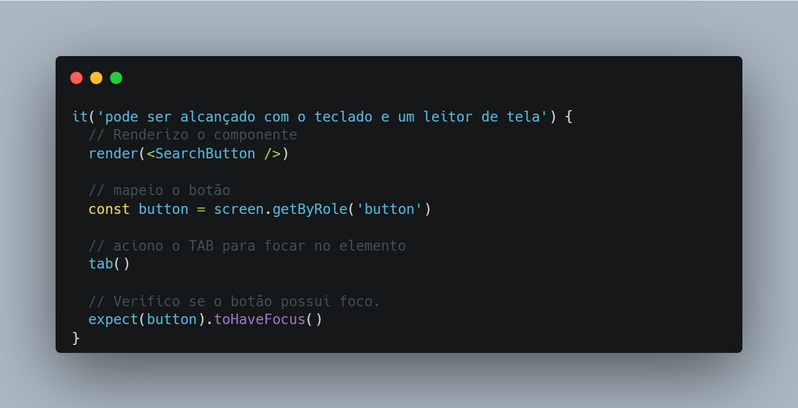

Dando sequência em nosso setup de automação, vamos falar sobre os **testes unitários**.

Testes unitários são recomendados por alguns motivos, entre eles:

- São rápidos e baratos;

- Não tem alto acoplamento;

- Testam pequenas partes do software;

- Não dependem de outros componentes.

Além dessas vantagens, podemos destacar outros benefícios:

- Melhoria da qualidade geral da base de código;

- Redução de duplicação e acoplamento entre módulos;

- Facilita refatoração;

- Aumento da segurança ao realizar modificações no código.

## Estratégias de teste

Uma estratégia muito interessante para os testes unitários é o TDD.

O TDD é uma metodologia de desenvolvimento de software, sua premissa é: testar antes do código existir.

Parece papo de maluco, mas no final faz sentido.

A grande dificuldade é mudar o paradigma.

Ele tem o lema:

> Escreva um teste (com falha). Depois algum código para fazê-lo passar. Garanta que o teste seja aprovado e repita para o próximo requisito.

Esse ciclo do TDD é sem fim.

E isso me deixou com a pulga atrás da orelha.

Se a acessibilidade é um processo de validação contínuo, porque não aliar os dois?

E ai que nasce o TDD focado em acessibilidade.

## TDD focado em acessibilidade

Para apoiar essa jornada você pode usar algumas bibliotecas, como:

- Testing Library;

- jest-dom;

- user-event.

Imagine o cenário, você precisa validar se os botões do design _system_ recebem o foco visível quando o usuário pressiona TAB.

Com o Testing Library e as bibliotecas mencionadas o teste ficaria assim:

Com esse simples teste, validamos o cenário proposto de maneira rápida e prática.

Um ponto importante para mencionar, a Testing Library possui versões para:

Existem versões do Testing Library para diversas bibliotecas e frameworks javascript, fica a gosto do freguês.

Outra abordagem, seria usar o Cypress Component Testing.

> Não importa qual a ferramenta, o objetivo do TDD é o mesmo.

Tenha em mente os seguintes pontos:

- Identifique o componente a ser testado;

- Escreva casos de testes descrevendo os comportamentos que não atende aos requisitos de acessibilidade;

- Faça os testes passarem corrigindo os problemas de acessibilidade no componente.

> Dica de ouro: procure as interações por teclado dos componentes, você pode extrair cenário de testes através deles.

Por exemplo, o \`<button>\`, você pode validar se ele será acionado via Space ou Enter.

As possibilidades são enormes, vale lembrar que tudo depende da taxa de cobertura dos testes.

Outro ponto importante: **os testes automatizados devem andar com os manuais**, além de dar um _double_ check traz maior confiabilidade nos casos de testes.

Para finalizar, algumas dicas de cenários focados em acessibilidade para você escrever:

- Verificar se os itens ocultos não podem ser acessados pelo teclado quando não deveriam, como num menu fechado;

- Os menus podem ser abertos e fechados com o teclado;

- Botões que mudam o rótulo segundo a ação do usuário;

- Os estados e rótulos ARIA são atualizados quando um componente de caixa de combinação é aberto e os itens são filtrados.

Bons testes!
