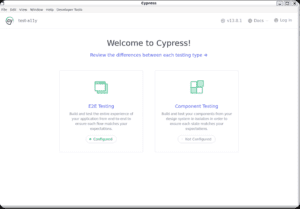
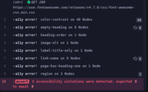

Chegamos ao fim do nosso setup!

Caso, você não leu as outras partes, não tem problema. Aqui estão:

- [Setup de automação parte 1](https://brunopulis.com/letters/automacao-para-acessibilidade/);

- [Setup de automação parte 2](https://brunopulis.com/letters/setup-automacao-de-acessibilidade-parte-2/).

Vamos recapitular o que aprendemos até aqui:

- É interessante começar os testes mais cedo;

- Testes estáticos validam erros em tempo de execução;

- Testes unitários validam pequenas partes do software;

- TDD é uma excelente estratégia de testes unitários;

- Podemos escrever TDD focado em acessibilidade;

- Acessibilidade desde o início todos saem ganhando.

Nessa sequência de e-mails, percebemos como a acessibilidade pode ser levada em consideração desde o início.

> **Para fixar:** pensar nela na última etapa pode custar muito caro.

Hoje quero te apresentar um teste que muitos amam e outros nem tanto: **os testes E2E**.

## Testes E2E

Em qualidade de software os testes E2E cumprem um papel importante, mas lembre-se esse carinha deve ser usado com sabedoria.

Eles são caros e lentos, devemos usar de forma estratégica em nossa abordagem de automação.

Se você pesquisar sobre esse tipo de teste, vai encontrar zilhões de ferramentas E2E, vamos focar no Cypress.

### Cypress

Quando ele foi lançado foi um alvoroço, ele tinha como premissa acabar com o uso de Drivers para testes.

Uma automação E2E antes do Cypress era um parto:

- Tinha que instalar o Selenium;

- Baixar Driver do navegador desejado;

- Acoplar o Selenium a uma linguagem de programação;

- Torcer para ter baixado a versão do driver certa e executar.

Além disso, na minha opinião, os comandos do Selenium são muito verbosos. Acho os do Cypress bem mais tranquilos.

Outra coisa linda do Cypress é a facilidade de sua instalação, somente rodar um comando do **npm** e a mágica estava feita.

> **Dica de ouro:** quer aprender mais? Procure os cursos do [Walmyr Filho](https://www.udemy.com/user/walmyr/) e os conteúdos do [Samuel Lucas](https://www.youtube.com/@Agilizei), ambos, são embaixadores do Cypress.

## Montando um projeto

Vou te mostrar um projeto de automação com Cypress simples, vamos validar a página da Prefeitura de Belo Horizonte.

Bora lá.

### Pré-requisitos

Você precisa ter instalando: o Node.js e um editor de código, recomendo o VSCode.

Criei um diretório chamado **tests-a11y**, navegue por ele e digite o comando: **npm init -y**.

Isso vai criar o arquivo **package.json**.

Após criado, execute o seguinte comando:

```shell-session
npm install cypress --save-dev
```

Isso vai instalar o Cypress como dependência local no seu projeto.

Agora, vamos rodar o Cypress pela primeira vez.

Use o comando:

`./node_modules/cypress/bin/cypress open`

Se tudo der certo, o resultado será:

<figure>



<figcaption>

Dashboard de boas-vindas do Cypress, ao lado direto está a configuração para os testes E2E no outro lado os testes de componentes.

</figcaption>

</figure>

Selecione a opção **E2E Testing**, e siga o passo a passo e pronto sua estrutura básica está pronta!

### Configurando as dependências

Agora temos que instalar as dependências para realizar os testes de acessibilidade.

Vamos usar duas:

- cypress-axe;

- axe-core.

Rode os comandos: **`npm i cypress-axe axe-core -D`**

Precisamos informar ao Cypress que vamos usar as dependências instaladas, por isso, vá no diretório **`supports\e2e.js`** e insira as linhas:

```javascript
// ***********************************************************
// This example support/e2e.js is processed and
// loaded automatically before your test files.
//
// This is a great place to put global configuration and
// behavior that modifies Cypress.
//
// You can change the location of this file or turn off
// automatically serving support files with the
// 'supportFile' configuration option.
//
// You can read more here:
// https://on.cypress.io/configuration
// ***********************************************************

// Import commands.js using ES2015 syntax:
import './commands'
import 'cypress-axe'
import 'axe-core'

// Alternatively you can use CommonJS syntax:
// require('./commands')
```

Para nosso experimente escolhi o site da Prefeitura de Belo Horizonte.

Dentro da pasta e2e, vou criar um novo teste chamado **`home.cy.js`**, seu script será:

```javascript
describe('Accessibility Tests', () => {
  beforeEach(() => {
    cy.visit('https://prefeitura.pbh.gov.br/')
  })

  it('Should pass accessibility tests', () => {
    cy.injectAxe() // Inject axe-core into the page
    // Run accessibility tests on the page
    cy.checkA11y()
  })
})
```

Simples assim!

Vale um detalhe, essa validação é mais geral.

Você pode escrever validações mais complexas, como:

- Verificar se os menus são acessíveis;

- Verificar se as imagens possuem ALT;

- e etc.

O resultado foi:

<figure>



<figcaption>

Erros de acessibilidade encontrados na página 40 de contraste, títulos vazios

</figcaption>

</figure>

E assim, finalizamos nosso setup de automação para acessibilidade.

Pequenas ações podem mudar o rumo da nossa forma de desenvolver as coisas.

Agora me conta, o que você não sabia que aprendeu aqui?
