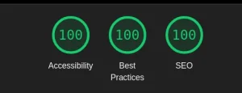

Pulis Letters - Edição #23  
Tempo de leitura: 3 minutos

Olá,  
Essa semana eu vi algo curioso no X, uma pessoa postou esse print do Lighthouse batendo o score de 100% de acessibilidade.

Sempre que vejo essas coisas, fico com a pulga atrás da orelha e me pergunto: Será mesmo?

Bom, eu sou curioso.

Fui checar o site pra surpresa de zero pessoas, tinha um monte bugs. 😥

* * *

## O que é o Lighthouse?

O Lighthouse é uma ferramenta de auditoria que ajuda desenvolvedores a melhores diversos pontos de aplicativos web, como:

- Performance;

- Acessibilidade;

- Boas Práticas;

- SEO.

Todos os itens que Lighthouse aponta são válidos, mas no caso de acessibilidade devemos ficar atentos.

Vou explicar o porquê, mas antes você precisa entender alguns pontos

Até aqui, tudo bem, certo? **Errado!**

Vou te explicar porquê.

## O Lighthouse é confiável?

Sim! Todas validações tem fundamento técnico e fazem sentido, mas quando o assunto é acessibilidade não podemos nos limitar só na validação automática.

> **Para fixar:** você que está aprendendo ou até mesmo começando com acessibilidade, não caia na _fake news_ que uma IA ou alguma ferramenta vai resolver **todos os problemas de acessibilidade**.

Fuja com todas as suas forças desse tipo de abordagem. Acessibilidade diz a respeito de uma coisa que poucos sabem bem: HTML.

Me lembrei do artigo [Building the most inaccessible site possible with a perfect Lighthouse score](https://www.matuzo.at/blog/building-the-most-inaccessible-site-possible-with-a-perfect-lighthouse-score/) do [Manuel Matuzović](https://www.matuzo.at/about-me).

Se você não conhece, vale a pena segui-lo.

Vou listar depois algumas referências de frontends bons em acessibilidade para você acompanhar.

Aonde eu estava? Ah sim, quando li esse artigo fiquei chocado e surpreendido.

## Qual o problema afinal?

O grande problema é que queremos um resultado quase instantâneo para algo que se leva tempo. Assim como tudo na vida, pra ficar bom em algo o teste do tempo é a melhor escola.

Para garantir a acessibilidade em qualquer site, devemos:

\- Usar o leitor de telas;  
\- Verificar a estrutura do HTML;  
\- Checar a AOM (Accessibility Object Model);  
\- Testar e testar.

Mesmo você sabendo pouco ou quase nada, tenha em mente: acessibilidade se faz com várias ferramentas e não existe bala de prata.

Por isso e outras motivos estou empolgando com a mentoria que vou lançar.  
Acredito que pode ajudar muitas pessoas que querem de fato aprender sem enrolação.

No mais é isso!

SDG,  
Pulis.
