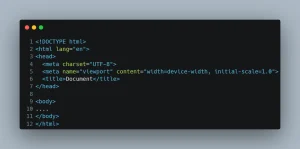
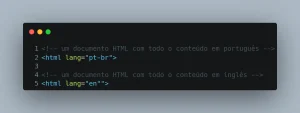
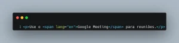

Pulis Letters - Edição #20
Tempo de leitura: 3 minutos

Sexta-feira passada tivemos uma experiência inusitada.
Fomos convidados para um estudo bíblico liderado por um casal de surdos.

Chegando lá, tive uma surpresa: **o estudo era em Libras**.

Sou um analfabeto em Libras, sei somente os sinais de:

- Pedir café;

- Obrigado.

Se quiser aprender te ensino. 🤣

Fiquei constrangido, porque experimentei o que pessoas com deficiência passam todos os dias.

Isso mexeu comigo!

---

## Como tudo começou

Iniciei a faculdade em 2007 e tive meu primeiro contato com HTML.

Lembro-me, como se fosse ontem. O professor deu um exercício para **escrever código no caderno**, na época odiei, hoje sou grato.

Obrigado professor que esqueci o nome! Por causa da repetição, acabei decorando quase todas *tags*.

E por incrível que pareça, isso me ajudou.

Só que tem um problema, dei um belo vacilo: esqueci o atributo **lang**.
E assim como eu, aposto que você nunca reparou nisso.

**Não é mesmo?**

Por isso, vou te ensinar a importância dele para seu código e a acessibilidade.

Vamos lá.

## A rotina de um frontend

O cotidiano de um frontend, tem várias tarefas repetitivas. Uma delas é escrever HTML.

E ninguém gosta de perder tempo escrevendo HTML. Existem diversos _autocompletes_por aí.

Já usei vários, o Emmet me ajuda muito, com ele minha rotina é assim:

- Criar um novo arquivo;

- Digitar: **html:5**, pra mágica acontecer;

- Deixar o *autocomplete* finalizar o trabalho;

- Pronto estrutura HTML feita.

**O resultado é parecido com isso:**

Até aqui, tudo bem, certo? **Errado!**
Vou te explicar porquê.

## Para quê serve o atributo lang?

O atributo **lang** faz parte da família dos atributos globais do HTML, ou seja, pode ser usado sem restrição em quase todos os elementos.
**Para fixar:** Seu objetivo é fornecer um mecanismo de internacionalização do conteúdo. Ele **é obrigatório na tag html**.

Pode ser aplicado de duas formas:

- **Definindo o idioma do documento HTML**;

- **Definindo o idioma para partes do documento, como: abreviações e  termos estrangeiros**.

Nessa [RFC](https://www.rfc-editor.org/rfc/bcp/bcp47.txt), você pode consultar os idiomas que estão disponíveis.

Beleza Pulis, **mas e a acessibilidade?**

Imagina comigo, você está desenvolvendo uma página que **o conteúdo todo será em português** e usou o código gerado pelo Emmet.

**O que vai acontecer?**

O conteúdo será interpretado pelo leitor de telas com a entonação, pronúncia e particularidades do inglês.

Ou seja, vai parecer um gringo tentando falar português.

**Para fixar:** o leitor de telas consegue através dos padrões de internacionalização ler as particularidades de cada língua, como: **entonação, pronúncia e sotaque**.

## [Idioma da página](https://www.w3.org/WAI/WCAG22/Understanding/language-of-page)

Esse critério da WCAG, define que os desenvolvedores forneçam um idioma padrão para o documento HTML.

Um exemplo:

## [Idioma em partes](https://www.w3.org/WAI/WCAG22/Understanding/language-of-parts)

Em contrapartida, esse critério é utilizado quando precisamos incluir expressões de outros idiomas dentro do nosso conteúdo.
Certas expressões fazem mais sentido no idioma nativo. Ninguém fala, vamos fazer uma reunião no Google. 😂

### Qual sua função?

Usando da forma certa, garantimos que a saída para os leitores tela tenham:

- Entonação;

- Pronúncia;

- Sotaque;

- Particularidades da língua.

Da forma ideal.

### Quem se beneficia?

- Pessoas que usam leitores de tela;

- Pessoas com dificuldade de ler material escrito com fluência e precisão;

- Pessoas com dificuldades cognitivas;

- Pessoas que dependem de legendas para mídias sincronizadas.

### Percebeu?

Um simples atributo ou a falta dele muda completamente o jogo.

**Resumindo:**

- O documento é em português, use lang="pt-br";

- Tem expressões de outro idioma, use um span com o valor no lang correto.

## Para se aprofundar

- [Atributo lang](https://developer.mozilla.org/pt-BR/docs/Web/HTML/Global_attributes/lang);

- [3.1.1 Idioma da página](https://www.w3.org/WAI/WCAG21/Understanding/language-of-page.html);

- [3.1.2 Idioma em partes](https://www.w3.org/WAI/WCAG21/Understanding/language-of-parts).

## O que ando assistindo, lendo ou ouvindo

- Comecei a assistir [Toda luz que não podemos ver](https://www.netflix.com/browse?jbv=81083008), conta a história de uma menina cega. Achei bem interessante;

- Enquanto escrevia, ouvia [The Winding Way - The Teskey Brothers](https://open.spotify.com/album/1AwOiNVDcnyX4YAcvNecvd?si=lSv84eyMRm-CaBLKpB3viQ)

- Estou lendo: [Meditar e aprender: Sobre o modo de aprender e meditar & Opúsculo aúreo sobre a arte de meditar](https://amzn.to/49nA60w) - afiliado Amazon.
