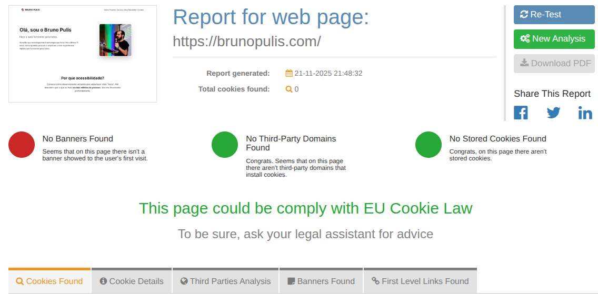

My approach is simple: **I respect your privacy as much as I protect my own. This site operates with zero tracking**.

## Analytics

I use [Umami](https://umami.is/docs) to collect browsing statistics only.

You can see the [real-time dashboard of my website](https://cloud.umami.is/analytics/us/share/JWxWUgpWDJBQZcAi).

No browsing data is collected.

## Cookies

- No cookies are installed on your device.
- There are no unique identifiers (IDs) for tracking.

> Check for yourself: Feel free to use tools such as [Cookie Metrix](https://www.cookiemetrix.com/) to audit this site. The result will be zero cookies.

Spoiler - there are no cookies! 🙂
